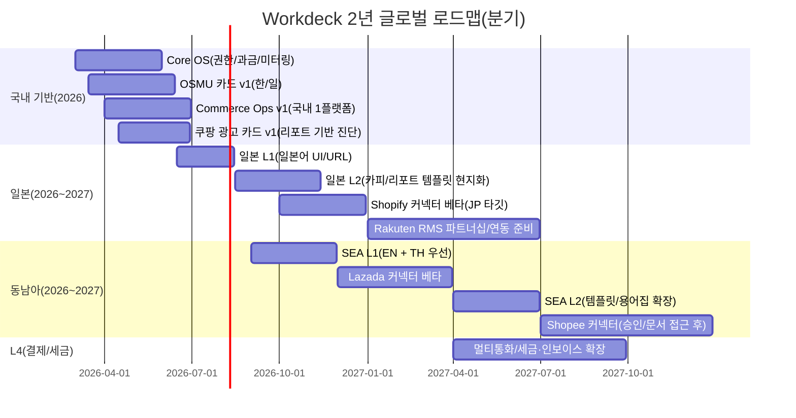
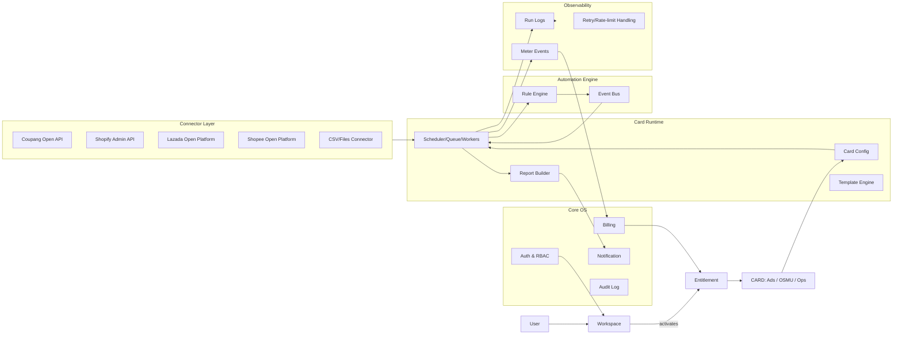

# Workdeck 전략 통합 리포트

작성일: 2026-02-22 (Asia/Seoul)

## 요약

Workdeck는 “나만의 업무 카드를 꽂아 쓰는 Business OS”로 포지셔닝한다. 이 개념은 제품을 **모듈(카드) 단위로 구매·활성화**하게 만들고, UX를 **카드 마켓(스토어) + 온보딩(First Value) + 자동화 실행/로그** 중심으로 재구성하며, 메시징을 **“연결하면 바로 돈/시간이 보이는 결과물”**로 정렬하게 한다.

확정 카드 3종은 (1) 쿠팡 광고 자동화, (2) OSMU(원소스 멀티유즈) 광고 제작, (3) 이커머스 매출·재고·정산/회계 운영 카드다. 국내에서는 쿠팡 운영 데이터를 중심으로 성과를 만들고, 글로벌은 일본, 동남아시아 우선순위로 확장한다. 다국어는 Google 권고처럼 언어별 **서로 다른 URL**과 `hreflang`로 확장할 수 있도록 정보를 설계한다.

가격은 카드별 **Base(구독) + Usage(사용량) + Add-on(확장 옵션)**을 기본으로 하며, 사용량 기반 과금은 결제/빌링 표준(Usage-based billing) 구조를 따른다.

기술적으로는 멀티테넌시를 **Shared DB + tenant key**로 시작하고, 커넥터·자동화·관측(Observability) 레이어를 분리해 카드 추가가 누적 부채로 이어지지 않게 만든다. AWS가 제시하는 멀티테넌시(풀/브릿지/사일로)와 테넌트 격리 개념을 참조해 설계를 표준화한다.

## 포지셔닝과 브랜드 개념

**브랜드 핵심 문장**: “나만의 업무 카드를 꽂는 Business OS”

### 제품 설계에 주는 함의

Step 1 — “카드”를 **상품·권한·설정·사용량**의 공통 단위로 정의

- 카드 = 결제 가능한 최소 단위(Entitlement의 단위).
- 카드가 활성화되면, 해당 카드의 커넥터(연동)·자동화(룰/스케줄)·리포트가 “OS 레벨의 공통 프레임” 안에서 동작한다(공통 권한/로그/과금).

Step 2 — “데이터(커넥터) → 자동화 → 결과물”을 OS의 기본 루프로 고정

- OS는 **앱 나열**이 아니라 **업무 실행 엔진**이다.
- 따라서 카드마다 “기능 목록”보다 “입력 데이터 → 자동 실행 → 산출물(리포트/액션)”이 먼저 보이게 설계한다.

Step 3 — 카드 간 연결(시너지)을 “기본값”으로 설계

- 광고 카드 ↔ 운영(매출/정산) 카드 ↔ 콘텐츠(OSMU) 카드를 단절된 도구가 아니라, 동일 워크스페이스에서 연결된 워크플로로 설계한다.

### UX에 주는 함의

Step 1 — IA(정보구조)는 “카드 스토어 → 설치 → 설정 → 첫 성과” 중심

- 홈: (a) 내가 꽂아둔 카드, (b) 오늘의 알림/액션, (c) 성과 요약.
- 카드 상세: “무엇이 자동화되는가”와 “첫 성과를 5분 안에 얻는 방법”이 최상단.

Step 2 — 온보딩의 목표는 ‘설명’이 아니라 **First Value 완성**

- “연동/데이터 입력 → 1회 리포트 생성 → 1개 액션 제안”을 1세션에서 끝낸다.
- 성공 경험을 만들면 사용자가 스스로 더 많은 카드를 꽂는다(확장 매출의 출발점).

### 메시징(카피/세일즈)에 주는 함의

Step 1 — “AI”보다 “업무 결과물”을 전면에 배치

- 예: “광고 최적화”가 아니라 “오늘의 낭비 예산 3개 캠페인 자동 진단”
- 예: “콘텐츠 생성”이 아니라 “한 번 쓰면 8채널 광고 카피로 자동 변환”

Step 2 — “설치(카드)” 은유를 일관되게 사용

- 카드 = 업무 모듈 / OS = 업무 실행 환경 / 연결 = 데이터 전원 공급

## 카드 제품 전략

아래 표는 확정 3개 카드의 **외부 서비스명(한/영)**, **내부 카드명**, **가치·기능·MVP·페르소나·KPI·First Value**를 비교 정리한 것이다.

| 구분                         | 쿠팡 광고                                                                                                                                                                                                                   | OSMU 광고 제작                                                                                                                                                           | 매출·재고·회계(운영)                                                                                                                                     |
| ---------------------------- | --------------------------------------------------------------------------------------------------------------------------------------------------------------------------------------------------------------------------- | ------------------------------------------------------------------------------------------------------------------------------------------------------------------------ | -------------------------------------------------------------------------------------------------------------------------------------------------------- |
| 외부 서비스명 (KR/EN)        | 쿠팡 광고 자동화 (Coupang Ads Automation)                                                                                                                                                                                   | 원소스 멀티유즈 광고 제작 (OSMU Ad Creator)                                                                                                                              | 이커머스 운영 자동화: 매출·재고·정산/회계 (Commerce Ops Automation)                                                                                      |
| 내부 카드명                  | Coupang Ads Card                                                                                                                                                                                                            | OSMU Content Card                                                                                                                                                        | Commerce Ops Card                                                                                                                                        |
| 핵심 가치 제안 (Value Props) | 1) 광고 성과 진단을 자동화<br>2) 낭비/비효율 탐지와 액션 제안<br>3) 운영 리듬(일/주간 루틴) 표준화                                                                                                                          | 1) 한 번 작성한 소스에서 다채널 광고 카피 생성<br>2) 톤/플랫폼 포맷에 맞춘 변환<br>3) 다국어 초안 생성으로 글로벌 제작 시간 단축                                         | 1) 매출·정산·재고 현황을 한 화면에서 파악<br>2) 품절/과재고 리스크를 사전에 경고<br>3) 정산/수수료 기반으로 운영 숫자(실수익) 가시화                     |
| 주요 기능 (Key Features)     | 1) 광고 리포트 기반 진단(캠페인/상품/키워드 단위)<br>2) 예산 페이싱, 이상치 탐지<br>3) 액션 리스트(“멈추기/늘리기/재구성” 제안)<br>4) 일간 자동 리포트(메일/슬랙 등)                                                        | 1) 입력: 블로그 글/상품 설명/랜딩 카피(텍스트)<br>2) 출력: 채널별 광고 문구/헤드라인/CTA·해시태그 변환<br>3) A/B 버전 자동 생성<br>4) 브랜드 톤 프리셋(말투/금칙어/길이) | 1) 매출·주문·정산 집계<br>2) SKU 재고 경고(안전재고/리드타임 기반)<br>3) 수수료/정산 기반 요약 리포트<br>4) 회계/세무용 내보내기(초기엔 표준 CSV)        |
| MVP 범위 (Scope)             | Step 1: 광고센터 리포트 **업로드(또는 사용자 제공 데이터)** 기반 분석<br>Step 2: 쿠팡 판매/정산 데이터(가능 범위) 연결 후 광고-매출 상관 지표 제공<br>Step 3: “자동 실행”은 API 가용성 확인 전까지 **추천/체크리스트 중심** | Step 1(필수): 텍스트 기반 OSMU(채널 템플릿 5~8개)<br>Step 2(필수): 다국어 초안(일본어/영어 우선) + 용어집<br>Step 3(선택): 팀 협업(리뷰/승인)                            | Step 1(필수): 단일 플랫폼(국내)부터 시작<br>Step 2(필수): 매출·정산(수수료/지급) 요약 리포트<br>Step 3(선택): 추가 채널/해외 플랫폼 커넥터 확장          |
| 타깃 페르소나                | 개인 셀러(월 300~3,000만)<br>운영 1~2명 소팀<br>대행/운영자가 여러 계정 관리하는 팀                                                                                                                                         | 1인 창업가/대표(마케팅 겸업)<br>소규모 마케팅 팀(3~10명)<br>콘텐츠를 ‘자주’ 뽑아야 하는 커머스 운영자                                                                    | 개인 셀러부터 운영팀까지<br>SKU/주문이 늘어 “Excel로 한계”가 온 팀<br>정산/수수료로 실수익을 보고 싶은 팀                                                |
| 추적 KPI                     | Activation: 첫 리포트 생성까지 시간(TTFV)<br>Engagement: 주간 활성 사용자/계정(WAU), 리포트 열람률<br>Outcome: 추천 액션 적용률, 성과 지표 변화(ROAS/ACOS 등)                                                               | Activation: 첫 변환 완료율, 1회 세션 출력물 수<br>Engagement: 생성량(월 카피/채널), 템플릿 재사용률<br>Outcome: 캠페인 생산성(제작시간 절감) 지표                        | Activation: 첫 동기화/첫 리포트까지 시간<br>Engagement: 일/주간 대시보드 방문, 알림 반응률<br>Outcome: 품절 발생률/과재고 지표, 정산 대사(불일치) 탐지율 |
| 온보딩 First Value           | “데이터 1회 입력 → 5분 내 계정 진단 리포트 + 오늘의 5개 액션”                                                                                                                                                               | “소스 1개 입력 → 3분 내 8채널 광고 카피 팩(다운로드)”                                                                                                                    | “연동 1회 → 오늘 매출/정산/재고 위험 3개 요약 카드 생성”                                                                                                 |

### 통합·연동 관점의 핵심 주의점

- 쿠팡 공식 개발자 포털에서 확인되는 것은 **OPEN API(상품/주문/CS/정산 등)**이며, 인증은 HMAC 기반으로 `Authorization` 헤더에 서명을 포함해야 한다.
- 정산 API는 “매출내역/지급내역 조회”를 다루며 워크플로 문서가 제공된다(즉, 운영/회계 카드의 핵심 데이터 소스가 될 수 있음)
- 반면 “광고 운영(캠페인 생성/수정/입찰 변경)”에 대해 공개된 공식 API가 확인되지 않으면, 광고 카드는 **(1) 리포트 기반 분석 → (2) 액션 추천** 중심 MVP로 설계하고, 공식 연동 범위가 확인되면 자동 실행을 단계적으로 확장하는 것이 안전하다(광고센터는 별도 포털로 운영됨).

## 모듈형 과금·패키징

### 과금 원칙: Base + Usage + Add-on

Step 1 — Base(구독): “카드를 꽂는 비용”

- 카드별 월 구독료(Starter/Pro/Team)로 진입 장벽을 낮춘다.

Step 2 — Usage(사용량): “많이 쓰는 고객이 더 내는 구조”

- 사용량 기반 과금은 SaaS에서 일반적인 모델이며, 투명한 미터링이 핵심이다.
- Workdeck의 사용량 단위는 “AI 토큰” 같은 내부 단위보다 **업무 단위(리포트 수, 동기화 수, SKU, 생성 콘텐츠 수)**가 납득 가능하다.

Step 3 — Add-on(확장): “커넥터/좌석/고급 기능”

- 개인→팀 확장, 멀티 계정/스토어, 고급 리포트/권한관리 등은 Add-on으로 분리해 “필요한 사람만 결제”를 실현한다.

### 카드별 가격(예시, KRW) 및 사용량 미터

아래 금액은 “개인~소규모 팀” 기준의 **예시**다(향후 실제 CAC/전환율/지원비용에 맞춰 조정).

**쿠팡 광고 자동화 (Coupang Ads Automation)**

| 플랜    |   월 요금 | 포함(Base)                 | 포함(Usage) 예시                                   | 초과/확장(Add-on) 예시                                     |
| ------- | --------: | -------------------------- | -------------------------------------------------- | ---------------------------------------------------------- |
| Starter |  39,000원 | 1 워크스페이스 / 1 사용자  | 월 리포트 30회 / 진단 룰 10개 / 데이터 업로드 30회 | 추가 사용자 +10,000원/월                                   |
| Pro     |  99,000원 | 1 워크스페이스 / 3 사용자  | 월 리포트 150회 / 진단 룰 30개 / 알림 채널 3개     | 추가 사용자 +10,000원/월<br>추가 워크스페이스 +30,000원/월 |
| Team    | 199,000원 | 1 워크스페이스 / 10 사용자 | 월 리포트 500회 / 진단 룰 100개 / 승인 워크플로    | SSO/감사로그(Enterprise 옵션)                              |

**OSMU 광고 제작 (OSMU Ad Creator)**

| 플랜    |   월 요금 | 포함(Base) | 포함(Usage) 예시                                        | 초과/확장(Add-on) 예시                |
| ------- | --------: | ---------- | ------------------------------------------------------- | ------------------------------------- |
| Starter |  29,000원 | 1 사용자   | 월 생성 60개(카피/버전 합산) / 템플릿 6종 / 언어 2개    | 추가 생성팩(200개) +20,000원/월       |
| Pro     |  79,000원 | 3 사용자   | 월 생성 250개 / 템플릿 12종 / 언어 5개                  | 브랜드 톤 가이드(프리셋) +30,000원/월 |
| Team    | 149,000원 | 10 사용자  | 월 생성 800개 / 템플릿 20종 / 언어 10개 / 승인 워크플로 | 고급 권한/감사로그 +50,000원/월       |

**이커머스 운영 자동화 (Commerce Ops Automation)**

| 플랜    |   월 요금 | 포함(Base)            | 포함(Usage) 예시                               | 초과/확장(Add-on) 예시         |
| ------- | --------: | --------------------- | ---------------------------------------------- | ------------------------------ |
| Starter |  49,000원 | 1 스토어/커넥터       | SKU 500 / 월 주문 동기화 5,000건 / 리포트 30회 | SKU 추가팩(1,000) +20,000원/월 |
| Pro     | 129,000원 | 최대 3 스토어/커넥터  | SKU 2,000 / 월 주문 30,000건 / 리포트 150회    | 스토어 추가 +30,000원/월       |
| Team    | 249,000원 | 최대 10 스토어/커넥터 | SKU 10,000 / 월 주문 150,000건 / 리포트 500회  | 고급 정산 대사·권한관리(옵션)  |

### 번들(묶음)과 연간 할인 규칙

- 번들 원칙: “업무 루프”를 만들어주는 카드 조합을 번들로 만든다.
  - **Growth 번들**: 쿠팡 광고 + Commerce Ops (합산 대비 15% 할인)
  - **Global Creator 번들**: OSMU + Commerce Ops (합산 대비 12% 할인)
- 연간 결제: “2개월 무료(약 16.7% 할인)”을 기본으로 하되, Team 플랜은 “1개월 무료(약 8.3%)”처럼 할인폭을 줄여 지원비용을 방어한다(운영·CS가 더 많이 듦).
- Usage 초과 과금: 월말 정산(후불)을 기본으로 하고, 미터링 이벤트 기반으로 투명하게 집계한다. citeturn7search0turn7search13

## 글로벌 확장 로드맵

### 국가 우선순위(일본 vs 동남아) 판단 근거

Step 1 — “API/커넥터 난이도”와 “카드별 해외 적합도”를 분리해 계산

- OSMU 카드는 **언어·문화 현지화(L1~L2)**만으로도 MVP 가치가 나올 가능성이 높다(플랫폼 커넥터 의존이 낮음).
- Commerce Ops/광고 카드는 **플랫폼별 커넥터(L3)**가 핵심이므로, 공식 문서·접근성·승인 프로세스가 확실한 플랫폼부터 시작하는 것이 리스크를 낮춘다.

Step 2 — 일본: “Shopify 우선 + Rakuten은 파트너십 트랙”이 현실적

- entity["company","Rakuten","japanese internet company"]은 공개형 Rakuten Web Service(주로 상품/랭킹 등) 문서를 제공하지만, 판매자 운영(RMS) 관련 Web API는 **출점/서비스 제공 기업 대상**으로 안내되며 공개 문서로 즉시 접근하기 어렵다는 점이 공식 FAQ에 명시돼 있다. citeturn8search1turn2search2
- 반면 entity["company","Shopify","ecommerce platform company"]는 Admin API(REST/GraphQL) 레퍼런스를 공개하고 버전 선택 구조를 제공해, 초기 커넥터 개발/운영 리스크가 상대적으로 낮다. citeturn1search1turn1search4

Step 3 — 동남아: Lazada는 공식 오픈 플랫폼 문서가 명확, Shopee는 접근성 확인 필요

- entity["company","Lazada","sea ecommerce company"]는 오픈 플랫폼 및 온보딩/레퍼런스를 제공한다. citeturn1search3turn1search6
- entity["company","Shopee","sea ecommerce company"]는 Open Platform을 통해 주문/제품/마케팅 등 Open API에 접근 가능하다고 안내한다. 다만 개발자 포털 접근(국가/계정/승인)에 따라 실제 문서 접근성이 달라질 수 있어, 초기에는 “OSMU 우선”으로 진입 후 Ops 커넥터를 단계적으로 붙이는 것이 안전하다. citeturn9search3

### 로컬라이제이션 레벨(L1~L4) 마일스톤

- L1: UI/카피 번역 + 언어별 URL 분리(국가/언어)
- L2: 템플릿(리포트/알림/카피) 현지화 + 용어집(커머스/광고 KPI)
- L3: 플랫폼 커넥터(주문/상품/정산) + 운영 워크플로 현지화
- L4: 결제/세금/인보이스·환불 정책 현지화 + 데이터 보관/규정 대응

Google은 다국어/다지역 사이트의 경우 언어별로 서로 다른 URL을 사용하고 `hreflang`로 변형 관계를 표시하는 방식을 안내한다. citeturn5view0turn1search2

### 국가별 GTM(Go-to-Market) 채널 제안

- 일본
  - SEO/콘텐츠: “작게 시작하는 팀의 운영 자동화” 키워드(블로그·가이드)
  - 파트너: Shopify 에이전시/개발사, 커머스 운영 컨설턴트
  - Rakuten 트랙: RMS 서비스 제공 기업이라면 “RMS Service Square” 같은 파트너 생태계 채널을 검토(파트너십 성격). citeturn8search6turn8search1
- 동남아
  - 채널: 지역별 판매자 커뮤니티 + 에이전시(리셀러) + 템플릿 기반 PLG(무료 템플릿 배포)
  - 커넥터: Lazada를 우선 연결하고, Shopee는 승인/문서 접근성이 확인되는 시점에 확장. citeturn1search3turn9search3

### 필수 커넥터/플랫폼 통합(우선순위)

- 한국: 쿠팡 OPEN API(주문/상품/정산 등) + 사용자 제공 광고 리포트(초기) citeturn10search1turn10search8
- 일본: Shopify Admin API(주문/상품/재고/고객 등) → Rakuten RMS(Web API) 파트너십 트랙 citeturn1search1turn8search1
- 동남아: Lazada Open Platform → Shopee Open Platform citeturn1search6turn9search3



## 가치 성장 전략과 핵심 지표

### “높은 가치”로 가는 구조: 커넥터-퍼스트 + 확장(업셀) 루프

Step 1 — 데이터 락인(Data lock-in)

- 커넥터가 늘고, 시간 축으로 누적되는 “운영 히스토리(정산·재고·성과)”가 쌓이면 대체 비용이 커진다.
- 특히 Ops 카드는 데이터 누적 가치가 크므로 이탈률(Churn)을 낮추는 중심 카드가 된다.

Step 2 — 커넥터-퍼스트 실행 루프

- 연결(커넥터/데이터) → 자동 진단 리포트 → 룰 추천/자동화 실행 → 성과 증명 리포트 → 추가 카드/상위 플랜 업셀
- 사용량 기반 과금은 제품 사용 데이터 자체가 확장 매출 신호가 된다. citeturn7search0turn7search10

Step 3 — 업셀 루프(카드 간)

- Ads 카드 고객에게 Ops 카드를 번들로 제안(성과 측정/정산 기반 인사이트 강화)
- Ops 고객에게 OSMU를 제안(성과가 좋은 상품/카테고리를 자동으로 광고 카피로 변환)

Step 4 — 장기: 마켓플레이스/서드파티 빌더

- “맞춤 자동화”를 내부 제작만으로 두지 않고, Verified Builder(에이전시/프리랜서) 생태계로 확장하면 플랫폼 밸류가 붙는다(카드 스토어의 네트워크 효과).

### 밸류에이션을 밀어올리는 지표(권장 트래킹)

Bessemer/OPENVIEW 등 클라우드/SaaS 벤치마크는 **순매출유지율(NRR)**, **효율(CAC payback 등)** 같은 지표를 핵심으로 제시한다. citeturn7search1turn7search2  
Workdeck에서는 아래를 “OS 관점”으로 재정의해 추적한다.

- ARPU / ARPA(계정당 매출)
- Gross Retention(매출 이탈) / Net Revenue Retention(확장 포함) citeturn7search1turn7search2
- LTV/CAC, CAC Payback(채널별) citeturn7search1turn7search2
- Monthly Active Cards(월간 활성 카드 수) / 계정당 활성 카드 수
- #Connectors(사용 가능한 커넥터 수) & 커넥터별 활성 계정 수
- Automation Runs(자동 실행 횟수) / 성공률 / 실패 재시도율
- TTFV(Time to First Value): 첫 성과까지 시간(온보딩 품질 지표)

## 기술 아키텍처

### 멀티테넌시 선택: Shared DB + tenant key(초기 권장)

AWS는 멀티테넌시를 풀(공유), 브릿지(스키마 분리), 사일로(DB 분리) 등 모델로 설명하며, 테넌트 격리(tenant isolation)는 “현재 테넌트 컨텍스트 기반으로 접근 제한”을 강조한다. citeturn7search3turn7search16  
Workdeck는 개인~소규모 팀이 주 타깃이므로 초기에는 비용·운영 효율이 높은 **Pool(공유) 기반 + 강한 격리**가 적합하다.

### 모듈 구성(권장)

- Core(OS 공통)
  - Auth/Workspace, RBAC 권한, Billing, Audit log, Notification
- Connector Layer
  - 플랫폼별 API/파일 커넥터(쿠팡/Shopify/Lazada/…)
- Card Runtime
  - 카드별 설정/템플릿/리포트 생성기
  - Job 스케줄러/큐/워커(비동기 처리)
- Automation Engine
  - Rule Engine(조건→액션), 이벤트 트리거, 페이싱/알림
- Observability
  - 실행 로그, 실패 재시도, 레이트리밋 대응, 추적(Tracing)

### Entitlement & Metering(권한/사용량) 설계

- Entitlement: “누가 어떤 카드를 어떤 플랜으로 쓸 수 있는가”
- Meter Event: “무엇을 얼마나 썼는가(리포트 1회, 동기화 1회, 생성 1건)”
- Invoice aggregation: 월말(또는 기간) 집계 후 과금

사용량 기반 과금은 미터(측정)와 이벤트 전송이 핵심 구성요소로 설명된다. citeturn7search13turn7search0

### i18n + 통화/세금 처리(글로벌 기본기)

- i18n: UI 번역(L1)과 템플릿/용어집(L2)을 분리
- 통화/세금: 국가별 통화·반올림·세금 표기 규칙을 “가격/정산 리포트 엔진”에서 분리(Ops 카드에서 특히 중요)
- 다국어 SEO: 언어별/국가별 URL을 분리하고 `hreflang` 또는 사이트맵으로 변형 관계를 명시한다. citeturn5view0turn1search2



## 도메인·SEO·GTM 로드맵과 리스크

### 도메인 & SEO 구조

**원칙**: 앱/문서/API는 서브도메인으로 분리하되, 서비스 랜딩(SEO 트래픽)은 디렉토리 기반으로 한 곳에 모은다.

- 서브도메인(역할 분리)
  - `app.workdeck.work` (로그인/대시보드)
  - `docs.workdeck.work` (헬프/가이드)
  - `api.workdeck.work` (API 게이트웨이/웹훅)
  - `www.workdeck.work` (마케팅/랜딩)

Google은 “site name”을 도메인 또는 서브도메인 단위로 정의하며, 서브디렉토리 단위는 지원하지 않는다고 명시한다(즉, `www` 같은 호스트 단위 운영이 실무적으로 더 깔끔해질 때가 있다). citeturn2search12

- 랜딩(서비스 페이지): 디렉토리 기반(언어/국가 포함)
  - 예시(코드 표기)

```text
www.workdeck.work/kr/cards/coupang-ads
www.workdeck.work/kr/cards/osmu
www.workdeck.work/kr/cards/commerce-ops

www.workdeck.work/jp/cards/osmu
www.workdeck.work/jp/cards/commerce-ops

www.workdeck.work/th/cards/osmu
www.workdeck.work/th/cards/commerce-ops
```

**왜 디렉토리 기반이 유리한가(SEO/운영 관점)**

- 다국어/다지역 URL 구조는 gTLD 하위에 “서브도메인(de.example.com)” 또는 “서브디렉토리(example.com/de/)” 모두 가능하며, Google은 각 옵션의 장단점을 표로 제시한다. citeturn5view0
- Workdeck는 “OS”로서 브랜드 권위를 쌓는 것이 중요하므로, 랜딩/가이드 콘텐츠는 한 호스트에 집중시키고 `hreflang`로 언어 변형을 연결하는 설계가 자연스럽다. citeturn5view0turn1search2

**hreflang 운영(핵심만)**

- 각 언어 페이지는 서로를 `rel="alternate" hreflang="..."`로 연결
- 자동 리다이렉트(브라우저 언어 기반 강제 이동)는 크롤링/사용자 경험 문제를 만들 수 있어 주의(언어 선택 링크 제공 권장). citeturn5view0

### GTM 우선순위와 6개월 MVP 로드맵(주/월 단위)

**우선순위 가설(현 단계 권장)**

- 수익화 초기엔 “쿠팡 광고 카드”가 직접적(명확한 ROI 니즈)
- 글로벌 확장/유입은 “OSMU 카드”가 빠름(플랫폼 의존 적음)
- 유지/락인은 “Commerce Ops 카드”가 담당(데이터 누적)

**0~4주(주 단위) — OS의 뼈대 + First Value 완성**

- Week 1
  - Product: Core(Workspace/RBAC), 카드 스토어 IA 확정, 카드 설정 스키마 정의
  - Ops: 미터 이벤트 정의(‘리포트 1회’, ‘동기화 1회’, ‘생성 1건’)
- Week 2
  - Product: OSMU v0(한글) — 입력/출력 템플릿 6종, 다운로드 패키징
  - Marketing: “원소스 멀티유즈 광고 카피” 키워드 랜딩 1개 오픈
- Week 3
  - Product: Commerce Ops v0 — “매출/정산 요약” 리포트 1종, CSV 커넥터
  - Partnership: 국내 셀러툴/커뮤니티 5곳 리스트업, 인터뷰 10건
- Week 4
  - Product: 쿠팡 광고 카드 v0 — 리포트 업로드 분석 + 액션 5개 출력
  - Ops: 실행 로그/실패 재시도(최소), 알림 채널(이메일) 연결

**2~6개월(월 단위) — 유료 전환과 확장 준비**

| 기간    | Product(핵심)                                 | Marketing(핵심)                 | Partnership(핵심)             | Ops(핵심)                                                      |
| ------- | --------------------------------------------- | ------------------------------- | ----------------------------- | -------------------------------------------------------------- |
| Month 2 | 3카드 모두 “First Value 5분” 달성률 측정/개선 | 비교/가이드 콘텐츠 시작(주 2편) | 베타 파트너 20계정 확보       | 과금/정산(최소) 오픈, CS 플레이북                              |
| Month 3 | Commerce Ops: 정산 대사(불일치 탐지) v1       | 케이스 스터디 3개 제작          | 회계/세무 파트너(콘텐츠 제휴) | 데이터 보관/백업, 권한/감사로그 최소                           |
| Month 4 | OSMU: 일본어 L1/L2 패키지(템플릿/용어집)      | JP 랜딩 + 검색 키워드 확장      | 일본 Shopify 파트너 탐색      | 다국어 URL/hreflang 적용 citeturn5view0turn1search2        |
| Month 5 | Shopify 커넥터 PoC(Ops 카드용)                | JP 유입 실험(콘텐츠/커뮤니티)   | Shopify 에이전시 3곳 파일럿   | 미터링/초과 과금 정책 정교화 citeturn7search0turn7search13 |
| Month 6 | 가격/패키징 A/B(Starter/Pro 기준)             | 유료 전환 퍼널 최적화           | 일본 베타 론칭 준비           | SLA/장애 대응/모니터링 강화                                    |

Shopify Admin API를 통한 앱/연동 개발은 공식 레퍼런스에 기반해 진행해야 하며, 버전 선택 구조를 제품 운영 프로세스(업데이트/테스트)와 묶어야 한다. citeturn1search1turn1search4

### 주요 리스크와 완화책

| 리스크                                           | 영향                                            | 완화책                                                                                                                             |
| ------------------------------------------------ | ----------------------------------------------- | ---------------------------------------------------------------------------------------------------------------------------------- |
| 쿠팡 “광고 운영” 공식 API 부재/제한 가능성       | 자동 실행(입찰/예산 조정) 기능이 늦어질 수 있음 | MVP는 “리포트 기반 진단/추천”으로 설계하고, 공식 연동 범위 확인 후 단계적 확장(추천→반자동→자동) citeturn6search1turn10search1 |
| Rakuten RMS API 문서 접근/승인 장벽              | 일본 Ops 확장이 지연될 수 있음                  | 일본 초기엔 Shopify 중심으로 시작, Rakuten은 파트너십 트랙으로 별도 추진 citeturn8search1turn1search1                          |
| Shopee 개발자 포털/승인·국가별 정책 차이         | SEA Ops 커넥터 일정 변동                        | Lazada 우선으로 L3 커넥터 확보 후 Shopee는 승인 확보 단계에서 착수 citeturn1search6turn9search3                                |
| 사용량 기반 과금에 대한 불신(“얼마 나올지 모름”) | 전환율 저하/이탈                                | 사용량 상한(캡), 실시간 사용량 대시보드, 초과 발생 전 알림 제공(Usage metering 권장 패턴) citeturn7search10turn7search0        |
| 멀티테넌시 격리/보안 이슈                        | 신뢰도 하락, B2B 계약 리스크                    | tenant isolation 원칙(컨텍스트 기반 접근 제한) 및 감사로그/권한 설계 표준화 citeturn7search16turn7search3                      |

### 확인 질문 5개(미응답 시 기본 가정 포함)

1. **쿠팡 광고 카드에서 “자동 실행(입찰/예산 변경)”이 MVP 필수인가요?**

- 기본 가정: v1은 “진단/추천” 중심, 자동 실행은 공식 연동 확인 후 단계적 도입.

2. **OSMU 카드의 1차 출력 채널은 무엇인가요(예: 블로그 요약/소셜 포스트/검색광고 카피)?**

- 기본 가정: “소셜+광고 카피(헤드라인/본문/CTA)”를 우선.

3. **Commerce Ops 카드의 ‘회계’는 어느 수준까지가 MVP인가요? (CSV 내보내기 vs 회계 소프트웨어 연동)**

- 기본 가정: MVP는 “정산/수수료 포함 요약 + 표준 CSV 내보내기”.

4. **팀 기능(RBAC/승인 워크플로)은 언제부터 유료 경쟁력이 되나요?**

- 기본 가정: Month 3~4부터 Pro/Team 차별점으로 도입.

5. **글로벌 1순위: 일본 vs 태국(SEA) 중 ‘6개월 내 실험’의 우선은?**

- 기본 가정: 6개월 내 일본(OSMU + Shopify PoC) 우선, SEA는 Lazada 커넥터 준비부터 착수.
