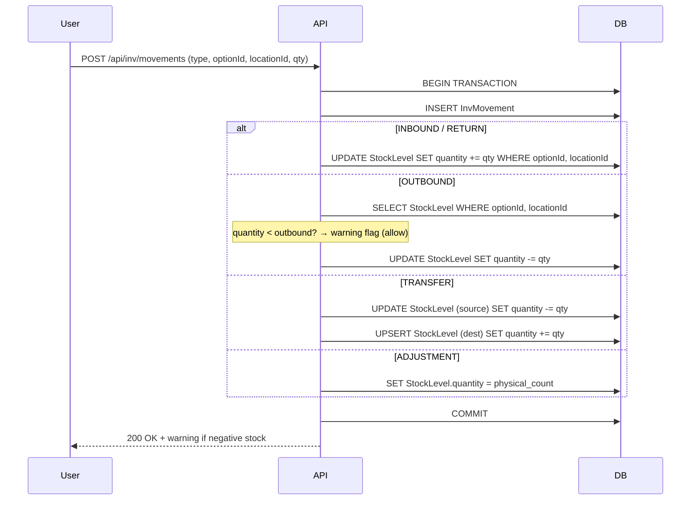

# feat: 통합 재고 관리 덱 (Integrated Inventory Management)

## Overview

워크덱 플랫폼에 새로운 "통합 재고 관리" 덱을 추가한다. 의식주의(AML)의 모든 재고를 위치별로 통합 관리하고, 입고/출고/반품/이동/조정의 이동 기록(ledger) 기반으로 재고를 추적하며, 출고 데이터를 기반으로 발주 수량을 예측해 현금흐름을 최적화한다.

## Problem Frame

의식주의는 여러 보관 위치와 판매 채널에 걸쳐 재고를 운영하지만, 현재 통합된 재고 관리 도구가 없다. 기존 쿠팡 광고 덱의 inventory 모듈은 쿠팡 로켓그로스 전용 스냅샷 기반이라 범용 재고 관리에 부적합하다. 새 덱은 이동 기록(movement ledger) 아키텍처로 완전 새 설계하며, Space 기반 멀티테넌트 구조를 적용한다.

## Requirements Trace

- R1. 워크덱 덱으로 등록 — 사용자가 My Deck에서 설치하여 사용
- R2. 상품/옵션 단위 관리 — 입고 시 자동 생성, 선택적 제품 코드
- R3. 이동 기록 기반 재고 추적 — INBOUND, OUTBOUND, RETURN, TRANSFER, ADJUSTMENT
- R4. 보관 위치별 재고 관리 — StockLevel 테이블로 위치별 현재 수량 유지
- R5. 판매 채널 관리 — 출고 시 채널 지정, 채널 그룹(상위 카테고리) 지원
- R6. 대시보드 — 위치별/전체 재고 현황, 시계열 변화, 채널/그룹별 필터
- R7. 재고 조정 — 수동 직접 조정 + 파일 기반 대조(reconciliation)를 통한 일괄 조정
- R8. 데이터 입력 — 수동 폼 + Excel/CSV 파일 업로드
- R9. 발주 예측 — 일평균 출고량 × 리드타임 - 현재재고 공식 기반 (v1)
- R10. 마이너스 재고 허용 — 경고 표시 후 입력 허용

## Scope Boundaries

- 기존 쿠팡 광고 덱의 inventory 모듈은 변경하지 않음 (별도 유지)
- 바코드/QR 스캐닝 — v1 미포함
- 공급업체(supplier) 관리 — v1 미포함, 리드타임은 상품별 설정으로 대체
- 실시간 알림(저재고 알림 등) — v1에서는 대시보드 시각적 표시만. 예외: 대량 재고 조정(20% 이상) 시 Slack 알림은 재고 무결성 보호 목적으로 v1 포함
- 멀티 통화 — 미지원

## Context & Research

### Relevant Code and Patterns

- **덱 라우트 패턴**: `src/lib/deck-routes.ts` — 덱 ID/경로 상수 정의
- **덱 레이아웃**: `app/d/coupang-ads/layout.tsx` — 인증 + Header/Sidebar variant 패턴
- **동적 덱 라우터**: `app/d/[deckKey]/page.tsx` — DECK_ROUTES 매핑으로 리다이렉트
- **API 헬퍼**: `src/lib/api-helpers.ts` — `resolveDeckContext()`, `resolveSpaceContext()`, `errorResponse()`
- **사이드바 variant**: `src/components/layout/sidebar.tsx` — SidebarVariant 타입, 덱별 라우트 배열
- **헤더 variant**: `src/components/layout/header.tsx` — 덱별 브랜드/색상/아이콘
- **Excel 파싱**: `src/lib/inventory-parser.ts` — SheetJS 기반, 헤더 자동 감지 패턴
- **업로드 프로세서**: `src/lib/inventory-upload-processor.ts` — Supabase Storage → 서버 처리 → 배치 삽입
- **DeckApp/DeckInstance**: `prisma/schema.prisma` 329-352행 — 덱 카탈로그 및 활성화 모델
- **Space/SpaceMember**: `prisma/schema.prisma` 300-326행 — 멀티테넌트 모델

### Institutional Learnings

- `docs/solutions/` 미존재 — 코드베이스 자체가 참조 패턴
- 기존 inventory 파서는 컬럼 유효성 검증 미비 → 새 파서에는 `ColumnValidationError` 패턴 적용 권장 (`excel-parser.ts` 참조)
- 업로드 처리 시 `createMany({ skipDuplicates: true })` + 배치 2000건 패턴 검증됨

## Key Technical Decisions

- **이동 기록(ledger) + StockLevel 이중 구조**: 모든 재고 변동은 `StockMovement` 레코드로 기록하고, `StockLevel` 테이블에 현재 수량을 트랜잭션으로 동기화. 빠른 조회 + 감사 추적 모두 확보
- **Space 기반 데이터 소유**: 모든 새 모델은 `spaceId` FK를 가짐. `resolveDeckContext('inventory-mgmt')` 사용
- **완전 새 모델**: 기존 쿠팡 InventoryRecord/InventoryUpload는 건드리지 않음. 새 모델 prefix: `Inv*` (InvProduct, InvMovement 등)
- **마이너스 재고 허용**: 출고 시 재고 부족이면 경고만 표시, 입력은 허용. 대시보드에서 마이너스 재고 시각적 강조
- **발주 예측 v1**: 공식 기반 (일평균 출고 × 리드타임 - 현재재고). LLM 없이 결정론적 계산
- **이동 기록 불변성**: 한번 기록된 이동은 수정/삭제 불가. 오류는 ADJUSTMENT로 보정
- **재고 조정 시 사유 필수**: reason 필드 required. 대량 조정(현재 재고 대비 20% 이상) 시 Slack 알림 (알림은 v1 예외적으로 포함 — 재고 무결성 보호 목적)
- **FOR UPDATE row locking**: Prisma 7은 `FOR UPDATE`를 typed API로 지원하지 않으므로, `prisma.$transaction(async (tx) => { await tx.$queryRaw\`SELECT ... FOR UPDATE\`; ... })` 패턴 사용. 코드베이스에 전례 없는 새 패턴이므로 구현 시 PgBouncer 트랜잭션 모드 호환성 검증 필요
- **Sidebar workspaceName → spaceName**: 기존 Sidebar는 `workspaceName` prop을 받지만, 새 덱은 Space 기반. Space.name을 workspaceName prop에 전달 (의미적으로는 다르지만 기능적 동일). 향후 Sidebar 리팩토링 시 generic `contextName`으로 전환
- **TRANSFER 재건(reconciliation) 알고리즘**: ledger에서 StockLevel 재건 시 TRANSFER는 특수 처리 — `locationId`에서 차감, `toLocationId`에 가산. 다른 타입은 1:1 매핑
- **stock-calculator 불필요**: StockLevel upsert 로직은 `movement-processor.ts` 내에 포함. 별도 파일 불필요 (200줄 초과 시 추출)
- **보관 위치별 외부 상품코드 매핑 (InvLocationProductMap)**: 각 보관 위치(쿠팡, 3PL 등)는 자체 상품코드/ID 체계를 갖고 있음. 시스템의 InvProductOption과 위치별 외부코드를 매핑하는 테이블을 별도로 관리. 최초 대조 시 상품명/옵션명으로 수동 매칭 → 매핑 저장 → 이후 동일 위치에서는 외부코드로 자동 매칭

## Open Questions

### Resolved During Planning

- **재고 계산 방식**: StockLevel 테이블로 확정 (이동 기록 합산이 아닌 트랜잭션 동기화)
- **마이너스 재고**: 경고 후 허용으로 확정
- **AI 범위**: v1은 공식 기반으로 확정
- **기존 모듈 관계**: 쿠팡 inventory와 완전 분리, 새 모델로 설계
- **테넌트 모델**: Space 기반으로 확정

### Deferred to Implementation

- **Excel 템플릿 세부 컬럼**: 구현 시 실제 사용할 컬럼명과 매핑 확정
- **대시보드 차트 세부 디자인**: 구현 시 UI 이터레이션으로 확정
- **Slack 알림 메시지 포맷**: 기존 `slack-inventory-notifier.ts` 패턴 참조하여 구현 시 확정
- **RETURN의 OUTBOUND 연결**: 선택적 참조로 구현, 세부 UI는 구현 시 결정

## High-Level Technical Design

> *This illustrates the intended approach and is directional guidance for review, not implementation specification. The implementing agent should treat it as context, not code to reproduce.*

### Data Model (ERD)

```mermaid
erDiagram
    Space ||--o{ InvProduct : "has"
    Space ||--o{ InvStorageLocation : "has"
    Space ||--o{ InvSalesChannel : "has"
    Space ||--o{ InvMovement : "has"
    Space ||--o{ InvStockLevel : "has"
    Space ||--o{ InvImportHistory : "has"
    Space ||--|| InvSettings : "has"
    Space ||--o{ InvReconciliation : "has"

    InvProduct ||--o{ InvProductOption : "has options"
    InvProductOption ||--o{ InvMovement : "tracked by"
    InvProductOption ||--o{ InvStockLevel : "stock at"
    InvProductOption ||--o{ InvReorderConfig : "config"

    InvStorageLocation ||--o{ InvStockLevel : "holds"
    InvStorageLocation ||--o{ InvMovement : "location"
    InvStorageLocation ||--o{ InvLocationProductMap : "external codes"

    InvProductOption ||--o{ InvLocationProductMap : "mapped by"

    InvSalesChannel }o--o| InvChannelGroup : "belongs to"
    InvSalesChannel ||--o{ InvMovement : "outbound channel"

    InvProduct {
        string id PK
        string spaceId FK
        string name
        string code "optional, unique per space"
        datetime createdAt
    }

    InvProductOption {
        string id PK
        string productId FK
        string name
        string sku "optional"
        datetime createdAt
    }

    InvStorageLocation {
        string id PK
        string spaceId FK
        string name
        boolean isActive
    }

    InvSalesChannel {
        string id PK
        string spaceId FK
        string name
        string groupId FK "optional"
        boolean isActive
    }

    InvChannelGroup {
        string id PK
        string spaceId FK
        string name
    }

    InvMovement {
        string id PK
        string spaceId FK
        string optionId FK
        string locationId FK
        string toLocationId FK "TRANSFER only"
        string channelId FK "OUTBOUND only"
        enum type "INBOUND|OUTBOUND|RETURN|TRANSFER|ADJUSTMENT"
        int quantity
        datetime movementDate
        datetime orderDate "OUTBOUND only"
        string reason "ADJUSTMENT required"
        string referenceId "optional, linked movement"
        string importHistoryId FK "optional"
    }

    InvStockLevel {
        string id PK
        string spaceId FK
        string optionId FK
        string locationId FK
        int quantity "can be negative"
        datetime updatedAt
        unique "optionId + locationId"
    }

    InvReorderConfig {
        string id PK
        string optionId FK
        int leadTimeDays
        int safetyStockQty
        int analysisWindowDays "default 90"
    }

    InvImportHistory {
        string id PK
        string spaceId FK
        string fileName
        string fileType "EXCEL|CSV"
        int totalRows
        int successRows
        int errorRows
        json errors "row-level error details"
        datetime importedAt
    }

    InvSettings {
        string id PK
        string spaceId FK "unique"
        string defaultLocationId FK "optional"
        string slackWebhookUrl "optional"
        json preferences "extensible settings"
    }

    InvLocationProductMap {
        string id PK
        string spaceId FK
        string locationId FK
        string optionId FK
        string externalCode "보관위치의 상품코드/ID"
        string externalName "보관위치의 상품명 (참조용)"
        string externalOptionName "보관위치의 옵션명 (참조용)"
        datetime createdAt
        unique "locationId + externalCode"
    }

    InvReconciliation {
        string id PK
        string spaceId FK
        string locationId FK
        string fileName
        datetime snapshotDate "파일 기준일자"
        enum status "PENDING|CONFIRMED|CANCELLED"
        json matchResults "매칭/미매칭/차이 상세"
        int totalItems
        int matchedItems
        int adjustedItems
        datetime createdAt
        datetime confirmedAt
    }
```

### Stock Movement Transaction Flow



## Implementation Units

### Phase 1: 데이터 모델 + 덱 등록

- [ ] **Unit 1: Prisma 스키마 — 새 inventory 모델 추가**

**Goal:** 통합 재고 관리에 필요한 모든 DB 모델을 정의하고 마이그레이션 적용

**Requirements:** R1, R2, R3, R4, R5, R7

**Dependencies:** None

**Files:**
- Modify: `prisma/schema.prisma`
- Create: `prisma/migrations/YYYYMMDD_add_inventory_management_models/migration.sql` (auto-generated)

**Approach:**
- 모든 모델명은 `Inv` prefix: InvProduct, InvProductOption, InvStorageLocation, InvSalesChannel, InvChannelGroup, InvMovement, InvStockLevel, InvReorderConfig, InvImportHistory, InvReconciliation, InvLocationProductMap, InvSettings
- 모든 모델에 `spaceId` FK + `@@index([spaceId])` 적용
- InvMovement.type은 enum `InvMovementType` (INBOUND, OUTBOUND, RETURN, TRANSFER, ADJUSTMENT)
- InvStockLevel에 `@@unique([optionId, locationId])` 복합 유니크 제약
- InvProduct.code에 `@@unique([spaceId, code])` (nullable이므로 code가 있을 때만 유니크)
- Decimal 타입 불필요 (수량 기반, 금액 없음) — quantity는 Int
- InvProduct.code nullable unique: PostgreSQL은 NULL 중복 허용하므로 `@@unique([spaceId, code])` 정상 동작. 단, Prisma `findUnique`는 null 복합키 미지원 → `findFirst` 사용
- Space 모델에 새 relation 필드 추가 필요 (InvProduct, InvStorageLocation 등 6개)
- `InvSettings` 모델 추가: 덱별 설정 저장 (기본 위치, Slack 웹훅 URL 등)

**Patterns to follow:**
- 기존 DeckApp/DeckInstance 모델 구조 (`prisma/schema.prisma` 329-352행)
- `@@index`, `@@unique`, `@default(cuid())` 패턴

**Test scenarios:**
- Happy path: `npx prisma migrate dev` 성공, 모든 테이블 생성 확인
- Happy path: Prisma Studio에서 각 모델 CRUD 가능 확인
- Edge case: InvStockLevel의 optionId+locationId 유니크 제약이 중복 삽입 차단하는지 확인

**Verification:**
- `npx prisma generate` 성공
- `npx prisma migrate dev` 성공
- `npm run build` 성공

---

- [ ] **Unit 2: DeckApp 등록 + 덱 라우트 상수 정의**

**Goal:** 통합 재고 관리 덱을 워크덱 시스템에 등록하고 라우트 상수 정의

**Requirements:** R1

**Dependencies:** Unit 1

**Files:**
- Modify: `src/lib/deck-routes.ts`
- Modify: `app/d/[deckKey]/page.tsx`
- Create: `prisma/seed.ts` 또는 수동 SQL (DeckApp 레코드 삽입)

**Approach:**
- `INVENTORY_MGMT_DECK_ID = 'inventory-mgmt'`
- `INVENTORY_MGMT_BASE_PATH = '/d/inventory-mgmt'`
- 각 페이지별 경로 상수 정의 (dashboard, movements, products, locations, channels, reorder, settings)
- `DECK_ROUTES`와 `DECK_ENTRY`에 새 덱 추가
- DeckApp 레코드: `{ id: 'inventory-mgmt', name: '통합 재고 관리', description: '...', isActive: true }`

**Patterns to follow:**
- `src/lib/deck-routes.ts`의 기존 COUPANG_ADS 상수 패턴
- `app/d/[deckKey]/page.tsx`의 DECK_ROUTES 매핑

**Test scenarios:**
- Happy path: `/d/inventory-mgmt`로 접근 시 올바른 페이지로 리다이렉트
- Edge case: 미등록 deckKey 접근 시 404 처리

**Verification:**
- DeckApp 레코드가 DB에 존재
- `/d/inventory-mgmt` 경로가 정상 라우팅

---

### Phase 2: 핵심 API + 레이아웃

- [ ] **Unit 3: 덱 레이아웃 — Header/Sidebar variant 추가**

**Goal:** 통합 재고 관리 덱의 레이아웃 구성 (인증, 사이드바 내비게이션, 헤더 브랜딩)

**Requirements:** R1, R6

**Dependencies:** Unit 2

**Files:**
- Create: `app/d/inventory-mgmt/layout.tsx`
- Modify: `src/components/layout/sidebar.tsx`
- Modify: `src/components/layout/header.tsx`

**Approach:**
- SidebarVariant 타입에 `'inventory-mgmt'` 추가
- INVENTORY_MAIN_ROUTES 배열 정의: 대시보드, 입출고 관리, 상품 관리, 위치 관리, 채널 관리, 재고 대조, 발주 예측, 설정
- Header에 inventory-mgmt variant: Package 아이콘, 녹색 계열 그래디언트
- layout.tsx는 coupang-ads/layout.tsx 패턴 따라 인증 + 스페이스 컨텍스트 해결

**Patterns to follow:**
- `app/d/coupang-ads/layout.tsx` — 서버 컴포넌트, getUser() + resolveDeckContext()
- `src/components/layout/sidebar.tsx` — variant 분기, COUPANG_MAIN_ROUTES 패턴

**Test scenarios:**
- Happy path: 덱 활성화된 사용자가 `/d/inventory-mgmt`에 접근하면 레이아웃 렌더링
- Error path: 미인증 → `/login` 리다이렉트
- Error path: 덱 미활성화 → `/my-deck` 리다이렉트

**Verification:**
- 사이드바에 모든 메뉴 항목 표시, 현재 페이지 하이라이트
- 헤더에 올바른 브랜딩 표시

---

- [ ] **Unit 4: 보관 위치 CRUD API + UI**

**Goal:** 보관 위치를 생성/조회/수정/비활성화하는 API와 관리 UI

**Requirements:** R4

**Dependencies:** Unit 3

**Files:**
- Create: `app/api/inv/locations/route.ts`
- Create: `app/api/inv/locations/[locationId]/mappings/route.ts` (위치별 외부코드 매핑 CRUD)
- Create: `app/d/inventory-mgmt/locations/page.tsx`
- Create: `src/components/inv/location-manager.tsx`
- Create: `src/components/inv/location-mapping-table.tsx` (위치별 외부코드↔상품 매핑 테이블)

**Approach:**
- GET: 스페이스의 모든 위치 목록 (isActive 필터 옵션)
- POST: 새 위치 생성 (name 필수, 중복 검증)
- PATCH: 이름 변경, 비활성화 (재고 > 0이면 비활성화 차단)
- `resolveDeckContext('inventory-mgmt')` 사용
- 위치 상세: 해당 위치의 InvLocationProductMap 목록 조회/수정/삭제 (외부코드↔시스템 상품 매핑 관리)
- 매핑은 주로 재고 대조(Unit 7b)에서 자동 생성되지만, 위치 관리 화면에서도 수동 확인/수정 가능

**Patterns to follow:**
- `app/api/inventory/excluded/route.ts` — CRUD API 패턴

**Test scenarios:**
- Happy path: 위치 생성 → 목록에 표시
- Happy path: 위치 이름 변경 성공
- Edge case: 같은 이름 위치 중복 생성 시 에러
- Edge case: 재고 있는 위치 비활성화 시 차단 + 에러 메시지
- Error path: 인증 없이 접근 시 401

**Verification:**
- 위치 CRUD가 UI에서 정상 동작
- 비활성화된 위치는 이동 기록 입력 시 선택 불가

---

- [ ] **Unit 5: 상품/옵션 관리 API + UI**

**Goal:** 상품과 옵션을 조회/수정하고, 제품 코드를 관리하는 API와 UI

**Requirements:** R2

**Dependencies:** Unit 3

**Files:**
- Create: `app/api/inv/products/route.ts`
- Create: `app/api/inv/products/[productId]/route.ts`
- Create: `app/d/inventory-mgmt/products/page.tsx`
- Create: `src/components/inv/product-list.tsx`
- Create: `src/components/inv/product-detail.tsx`

**Approach:**
- GET /api/inv/products: 페이지네이션, 검색(이름/코드), 정렬
- GET /api/inv/products/[id]: 상품 상세 + 옵션 목록 + 최근 이동 기록
- PATCH: 상품명, 제품 코드 수정 / 옵션명, SKU 수정
- 상품 생성은 직접 하지 않음 — 입고(INBOUND) 시 자동 생성
- 제품 코드 유니크 검증 (spaceId + code)

**Patterns to follow:**
- `app/api/inventory/route.ts` — 페이지네이션 쿼리 파라미터 패턴

**Test scenarios:**
- Happy path: 상품 목록 페이지네이션 조회
- Happy path: 제품 코드 설정/변경
- Edge case: 중복 제품 코드 설정 시 에러
- Happy path: 상품 상세에서 옵션별 현재 재고 + 최근 이동 기록 표시

**Verification:**
- 상품 목록이 페이지네이션으로 표시
- 제품 코드로 검색 가능

---

- [ ] **Unit 6: 판매 채널/채널 그룹 관리 API + UI**

**Goal:** 판매 채널과 상위 카테고리(그룹) CRUD

**Requirements:** R5

**Dependencies:** Unit 3

**Files:**
- Create: `app/api/inv/channels/route.ts`
- Create: `app/api/inv/channel-groups/route.ts`
- Create: `app/d/inventory-mgmt/channels/page.tsx`
- Create: `src/components/inv/channel-manager.tsx`

**Approach:**
- 채널 그룹: GET/POST/PATCH (이름 CRUD)
- 채널: GET/POST/PATCH (이름, 그룹 연결, 비활성화)
- 채널은 출고 시 선택 — 없으면 출고 기록 UI에서 바로 생성 가능 (인라인 생성)
- 비활성화된 채널은 새 출고에서 선택 불가, 기존 기록은 유지

**Patterns to follow:**
- `app/api/inv/locations/route.ts` (Unit 4에서 구현한 패턴)

**Test scenarios:**
- Happy path: 그룹 생성 → 채널을 그룹에 할당 → 대시보드에서 그룹별 필터
- Happy path: 채널 인라인 생성 (출고 입력 화면에서)
- Edge case: 기존 출고 기록이 있는 채널 비활성화 시 기록 유지 확인

**Verification:**
- 채널/그룹 CRUD UI 정상 동작
- 출고 입력 시 채널 선택 드롭다운에 활성 채널만 표시

---

### Phase 3: 이동 기록 + 재고 관리 (핵심)

- [ ] **Unit 7: 이동 기록 API — 트랜잭션 기반 재고 변동**

**Goal:** 모든 재고 이동(입고/출고/반품/이동/조정)을 기록하고 StockLevel을 트랜잭션으로 동기화하는 핵심 API

**Requirements:** R3, R4, R7, R10

**Dependencies:** Unit 4, Unit 5, Unit 6

**Files:**
- Create: `app/api/inv/movements/route.ts`
- Create: `src/lib/inv/movement-processor.ts`

**Approach:**
- POST /api/inv/movements: 이동 기록 생성 + StockLevel 업데이트를 하나의 Prisma `$transaction`으로 처리
- movement-processor.ts: 타입별 검증 로직 분리
  - INBOUND: 상품/옵션 미존재 시 자동 생성 (upsert), StockLevel += qty
  - OUTBOUND: channelId 필수, StockLevel -= qty, 마이너스 시 warning 플래그
  - RETURN: StockLevel += qty, 선택적 referenceId (원본 출고)
  - TRANSFER: fromLocationId + toLocationId 필수, source -= qty, dest += qty
  - ADJUSTMENT: reason 필수, StockLevel.quantity = adjustedQuantity, 대량 조정 시 Slack 알림
- StockLevel upsert 로직은 movement-processor.ts 내에 포함 (별도 파일 불필요)
- GET /api/inv/movements: 이동 기록 조회 (타입/상품/위치/기간 필터, 페이지네이션)
- DB 레벨 row locking: `$transaction`에서 StockLevel 조회 시 `FOR UPDATE` 사용

**Patterns to follow:**
- `src/lib/inventory-upload-processor.ts` — 트랜잭션 + 배치 처리 패턴
- `src/lib/api-helpers.ts` — resolveDeckContext, errorResponse

**Test scenarios:**
- Happy path: INBOUND으로 새 상품/옵션 자동 생성 + StockLevel 증가
- Happy path: OUTBOUND으로 StockLevel 감소 + 판매 채널 기록
- Happy path: TRANSFER로 source 감소 + dest 증가 (합산 불변)
- Happy path: ADJUSTMENT로 StockLevel을 특정 값으로 설정
- Happy path: RETURN으로 StockLevel 증가
- Edge case: OUTBOUND 시 재고 부족 → warning 플래그 반환 + 기록 허용
- Edge case: TRANSFER 시 source와 dest가 같은 위치 → 에러
- Edge case: ADJUSTMENT에서 현재재고 대비 20% 이상 변동 → Slack 알림 트리거
- Error path: OUTBOUND에 channelId 누락 → 400 에러
- Error path: ADJUSTMENT에 reason 누락 → 400 에러
- Error path: 비활성화된 위치로 이동 시 → 400 에러
- Integration: INBOUND → 상품 자동 생성 → StockLevel 생성이 하나의 트랜잭션으로 완료

**Verification:**
- 모든 이동 타입별 StockLevel이 정확히 동기화
- 동시 요청 시 데이터 정합성 유지

---

- [ ] **Unit 8: 이동 기록 입력 UI — 수동 폼**

**Goal:** 각 이동 타입별 수동 입력 폼 UI

**Requirements:** R3, R8

**Dependencies:** Unit 7

**Files:**
- Create: `app/d/inventory-mgmt/movements/page.tsx`
- Create: `src/components/inv/movement-form.tsx`
- Create: `src/components/inv/movement-history.tsx`

**Approach:**
- 이동 타입 선택 → 타입별 폼 필드 동적 변경
  - INBOUND: 상품명/옵션명(자동완성 또는 신규 입력), 수량, 위치, 날짜
  - OUTBOUND: 상품/옵션(자동완성), 수량, 위치, 판매 채널(인라인 생성 가능), 날짜, 주문일자
  - RETURN: 상품/옵션, 수량, 위치, 날짜, 참조 출고(선택)
  - TRANSFER: 상품/옵션, 수량, 출발 위치, 도착 위치, 날짜
  - ADJUSTMENT: 상품/옵션, 위치, 실물 수량, 사유, 날짜
- 마이너스 재고 경고: OUTBOUND/TRANSFER 시 재고 부족이면 확인 다이얼로그
- 이동 기록 목록: 날짜 역순, 타입 배지, 필터바 (타입/상품/위치/기간)

**Patterns to follow:**
- `src/components/inventory/inventory-upload-form.tsx` — Dialog 기반 폼 패턴
- `src/components/dashboard/DashboardClient.tsx` — 필터바 + 목록 패턴

**Test scenarios:**
- Happy path: 각 이동 타입별 폼 입력 → 제출 → 목록에 표시
- Happy path: INBOUND에서 새 상품명 입력 → 자동 생성 확인
- Edge case: OUTBOUND 시 재고 부족 → 경고 다이얼로그 → 확인 후 저장
- Edge case: ADJUSTMENT에서 사유 미입력 → 유효성 검증 에러
- Happy path: 이동 기록 필터링 (타입별, 기간별)

**Verification:**
- 모든 이동 타입 폼이 올바르게 동작
- 입력 후 목록이 즉시 갱신

---

- [ ] **Unit 9: Excel/CSV 대량 가져오기**

**Goal:** Excel/CSV 파일을 업로드하여 대량으로 이동 기록 생성

**Requirements:** R8

**Dependencies:** Unit 7

**Files:**
- Create: `app/api/inv/import/route.ts`
- Create: `src/lib/inv/import-parser.ts`
- Create: `src/lib/inv/import-processor.ts`
- Create: `src/components/inv/import-dialog.tsx`
- Create: `src/components/inv/import-template.tsx` (다운로드 버튼)
- Modify: `vercel.json` (import API maxDuration 추가)

**Approach:**
- 고정 템플릿 제공 (다운로드 가능)
  - 컬럼: 날짜, 이동타입, 상품명, 옵션명, 제품코드(선택), 수량, 위치, 판매채널(출고만), 주문일자(출고만), 사유(조정만)
- import-parser.ts: SheetJS로 파싱 + 컬럼 유효성 검증 (`ColumnValidationError` 패턴)
- import-processor.ts: 행별 검증 → 유효한 행만 배치 처리 → 에러 행은 InvImportHistory.errors에 기록
- **배치 트랜잭션 전략**: 행별 개별 트랜잭션이 아닌, N건(예: 100건) 단위로 하나의 트랜잭션으로 묶어 처리. 각 배치 내에서 모든 StockLevel 업데이트를 한번에 수행
- **Vercel 타임아웃 대응**: `vercel.json`에 import API 라우트의 `maxDuration` 추가 (기존 `reports/upload` 패턴 참조)
- 결과 UI: 총 N건 중 성공 M건, 실패 K건 + 에러 상세 표시

**Patterns to follow:**
- `src/lib/excel-parser.ts` — ColumnValidationError, REQUIRED_COLUMNS 패턴
- `src/lib/inventory-upload-processor.ts` — 배치 처리, 에러 핸들링

**Test scenarios:**
- Happy path: 유효한 Excel 파일 업로드 → 전체 성공
- Happy path: INBOUND + OUTBOUND 혼합 파일 업로드 → 각각 정상 처리
- Edge case: 일부 행에 에러 → 유효한 행만 처리, 에러 행 보고
- Edge case: 필수 컬럼 누락 → 파일 전체 거부 + 에러 메시지
- Edge case: 빈 파일 → 적절한 에러 메시지
- Error path: 지원하지 않는 파일 형식 → 400 에러

**Verification:**
- 템플릿 다운로드 → 데이터 입력 → 업로드 → 이동 기록 + StockLevel 정확히 반영
- InvImportHistory에 업로드 이력 기록

---

- [ ] **Unit 7b: 파일 기반 재고 대조 (Reconciliation)**

**Goal:** 외부 재고 현황 파일(쿠팡 inventory_health, 3PL 현재고조회 등)을 업로드하여 시스템 재고와 대조하고, 차이를 ADJUSTMENT로 일괄 생성

**Requirements:** R7, R8

**Dependencies:** Unit 7 (movement API), Unit 4 (locations), Unit 5 (products)

**Files:**
- Create: `app/api/inv/reconciliation/route.ts` (POST: 파일 업로드+파싱+매칭, GET: 이력)
- Create: `app/api/inv/reconciliation/[id]/route.ts` (GET: 상세, POST: 확정/취소)
- Create: `src/lib/inv/reconciliation-parser.ts` (파일 포맷 자동 감지+파싱)
- Create: `src/lib/inv/reconciliation-matcher.ts` (위치별 외부코드 매핑 기반 매칭+diff 계산)
- Create: `src/lib/inv/reconciliation-processor.ts` (확정 시 ADJUSTMENT 일괄 생성)
- Create: `app/d/inventory-mgmt/reconciliation/page.tsx`
- Create: `src/components/inv/reconciliation-upload.tsx`
- Create: `src/components/inv/reconciliation-preview.tsx` (diff 테이블 UI)
- Create: `src/components/inv/reconciliation-history.tsx`

**Approach:**
- 3단계 프로세스:
  1. **업로드+파싱**: 파일 포맷 자동 감지 (헤더 기반)
     - 쿠팡 `inventory_health`: "등록상품 ID", "SKU ID" 헤더 → 2행 병합 헤더 처리 (`mergeHeaders()` 패턴), 판매가능재고 추출
     - 3PL `현재고조회`: "상품코드", "가용재고", "로케이션" 헤더 → 단일 헤더, 로케이션별 재고
     - 범용 포맷: "제품코드", "수량" 최소 필수 컬럼
  2. **매칭+비교** (InvLocationProductMap 활용):
     - 파일의 각 행에서 외부코드(상품코드/상품ID/SKU ID) 추출
     - 해당 위치(locationId)의 `InvLocationProductMap`에서 externalCode로 InvProductOption 매칭 시도
     - **매핑 있음** → 자동 매칭, 파일 수량 vs StockLevel 수량 비교
     - **매핑 없음 (최초)** → 상품명/옵션명으로 후보 제시 + 사용자 수동 매핑 UI
     - 수동 매핑 확정 시 `InvLocationProductMap`에 매핑 저장 → 다음 대조부터 자동 매칭
     - 결과 4가지: matched-diff(차이있음), matched-equal(일치), file-only(미매핑), system-only(파일에 없음)
  3. **미리보기+확정**:
     - diff 테이블: 상품명, 옵션명, 시스템수량, 파일수량, 차이, 조정여부(체크박스)
     - 사용자가 조정 항목 선택/해제 후 "적용" → ADJUSTMENT 이동기록 일괄 생성
     - reason 자동: "파일 대조 조정 (YYYY-MM-DD 기준, 파일: filename.xlsx)"
     - reconciliationId를 각 ADJUSTMENT의 referenceId에 저장
- 대조 이력(InvReconciliation)에 결과 저장 (status: PENDING → CONFIRMED/CANCELLED)
- 사용자 선택 위치 + 파일의 기준일자를 ADJUSTMENT movementDate로 사용

**Patterns to follow:**
- `src/lib/inventory-parser.ts` — 헤더 자동 감지, `mergeHeaders()` 2행 병합 처리
- `src/lib/excel-parser.ts` — `ColumnValidationError`, `REQUIRED_COLUMNS` 패턴
- `src/lib/inventory-upload-processor.ts` — 배치 처리 패턴

**Test scenarios:**
- Happy path: 최초 대조 — 쿠팡 inventory_health 업로드 → 매핑 없음 → 상품명/옵션명으로 수동 매핑 → 매핑 저장 → diff 미리보기 → 확정 → ADJUSTMENT 생성
- Happy path: 2회차 대조 — 같은 위치에서 파일 업로드 → InvLocationProductMap에서 자동 매칭 → 수동 매핑 불필요
- Happy path: 3PL 현재고조회 파일 업로드 → 상품코드로 위치별 매핑 조회 → 자동/수동 매칭 → 확정
- Happy path: 미매핑 상품을 수동 매핑 후 대조에 포함 + 매핑 저장
- Edge case: 같은 상품이 쿠팡에서는 SKU=67356765, 3PL에서는 상품코드=10141 → 위치별로 별도 매핑 유지
- Edge case: 파일에만 있는 상품 (시스템 미등록) → file-only로 표시, 매핑 불가 항목은 건너뛰기
- Edge case: 시스템에만 있는 상품 (파일에 없음) → system-only로 표시 (자동 조정 안함)
- Edge case: 모든 재고 일치 → "모든 재고가 일치합니다" 메시지, 조정 항목 없음
- Edge case: 이미 PENDING 상태인 대조 건이 있을 때 → 경고 표시, 기존 건 처리 후 새 업로드
- Error path: 지원하지 않는 파일 포맷 → 에러 메시지
- Error path: 필수 컬럼(제품코드/수량) 누락 → ColumnValidationError
- Integration: 확정 시 movement-processor.ts의 ADJUSTMENT 로직을 재사용하여 StockLevel 동기화

**Verification:**
- 참조 파일(`docs/source_ref/inventory_health_sku_info_20260411115911.xlsx`, `docs/source_ref/현재고조회_20260412082506_906806521.xls`) 모두 정상 파싱
- 제품코드 매칭 → diff 미리보기 → 확정 → StockLevel 반영 전체 플로우 동작
- 대조 이력 페이지에서 과거 대조 결과 확인 가능

---

### Phase 4: 대시보드 + 발주 예측

- [ ] **Unit 10: 대시보드 — 재고 현황 + 시계열**

**Goal:** 위치별/전체 재고 현황, 시계열 재고 변화, 채널/그룹별 필터를 제공하는 대시보드

**Requirements:** R6

**Dependencies:** Unit 7

**Files:**
- Create: `app/d/inventory-mgmt/page.tsx` (대시보드 홈)
- Create: `app/api/inv/dashboard/summary/route.ts`
- Create: `app/api/inv/dashboard/timeseries/route.ts`
- Create: `src/components/inv/dashboard-summary.tsx`
- Create: `src/components/inv/dashboard-chart.tsx`
- Create: `src/components/inv/dashboard-filters.tsx`

**Approach:**
- 요약 카드: 전체 SKU 수, 전체 재고 수량, 마이너스 재고 상품 수, 오늘 입/출고 건수
- 위치별 재고: StockLevel을 locationId별 그룹핑 → 카드 또는 테이블
- 시계열: InvMovement를 날짜별 그룹핑 (입고/출고/반품 각각) → Recharts 라인 차트
  - 기본 30일, 날짜 범위 선택 가능
- 필터: 판매 채널, 채널 그룹, 위치 — 적용 시 시계열과 요약 모두 필터링
- 마이너스 재고 시각적 강조 (빨간색 배지)

**Patterns to follow:**
- `src/components/dashboard/DashboardClient.tsx` — KPI 카드 + 차트 조합
- `src/components/dashboard/CampaignChart.tsx` — Recharts 사용 패턴
- `src/components/inventory/inventory-summary-cards.tsx` — 요약 카드 패턴

**Test scenarios:**
- Happy path: 이동 기록이 있을 때 요약 카드에 정확한 수치 표시
- Happy path: 시계열 차트에 날짜별 입/출고량 표시
- Happy path: 위치 필터 적용 시 해당 위치의 데이터만 표시
- Happy path: 채널 그룹 필터 적용 시 해당 그룹 채널의 출고 데이터만 표시
- Edge case: 데이터 없을 때 빈 상태 UI 표시
- Edge case: 마이너스 재고 상품이 시각적으로 강조

**Verification:**
- 대시보드가 실시간 데이터를 정확히 반영
- 필터가 모든 위젯에 동시 적용

---

- [ ] **Unit 11: 발주 예측 화면**

**Goal:** 상품/옵션별 발주 필요량을 공식 기반으로 계산하여 표시

**Requirements:** R9

**Dependencies:** Unit 7

**Files:**
- Create: `app/d/inventory-mgmt/reorder/page.tsx`
- Create: `app/api/inv/reorder/route.ts`
- Create: `app/api/inv/reorder/config/route.ts`
- Create: `src/lib/inv/reorder-calculator.ts`
- Create: `src/components/inv/reorder-table.tsx`
- Create: `src/components/inv/reorder-config-form.tsx`

**Approach:**
- reorder-calculator.ts: 발주 공식
  - 분석 기간(기본 90일) 내 일평균 출고량 = 총 출고량 / 기간일수
  - 필요 재고 = 일평균 출고량 × 리드타임(일) + 안전재고
  - 발주 수량 = max(0, 필요 재고 - 현재 재고)
  - 예상 소진일 = 현재 재고 / 일평균 출고량
- InvReorderConfig: 상품/옵션별 리드타임, 안전재고, 분석기간 설정
- UI: 테이블 (상품/옵션, 현재재고, 일평균출고, 리드타임, 발주필요량, 예상소진일)
  - 발주 필요량 > 0인 상품 상단 정렬
  - 소진 임박 상품 시각적 강조 (7일 이내)
- 리드타임 인라인 편집 가능

**Patterns to follow:**
- `src/lib/inventory-analyzer.ts` — 분석 결과 계산 + 저장 패턴

**Test scenarios:**
- Happy path: 출고 이력이 있는 상품 → 발주량 정확히 계산
- Happy path: 리드타임 변경 → 발주량 즉시 재계산
- Edge case: 출고 이력 없는 상품 → 일평균 0 → 발주량 0
- Edge case: 현재 재고 > 필요 재고 → 발주량 0
- Edge case: 마이너스 재고 → 발주 필요량에 반영

**Verification:**
- 공식 계산 결과가 수동 검산과 일치
- 리드타임 설정 변경이 실시간 반영

---

### Phase 5: 설정 + 마무리

- [ ] **Unit 12: 설정 페이지 + DeckApp 시드 데이터**

**Goal:** 덱 설정 페이지와 초기 사용 가이드

**Requirements:** R1

**Dependencies:** Unit 3

**Files:**
- Create: `app/d/inventory-mgmt/settings/page.tsx`
- Create: `src/components/inv/settings-panel.tsx`

**Approach:**
- 설정 항목: 기본 위치 설정, Slack 알림 설정 (웹훅 URL) — `InvSettings` 모델에 저장 (Unit 1 스키마에 포함)
- 초기 셋업 가이드: 첫 진입 시 "1. 위치 생성 → 2. 첫 입고 등록" 안내

**Test expectation:** none -- 순수 UI/설정 페이지, 비즈니스 로직 없음

**Verification:**
- 설정 값이 저장되고 다시 접근 시 유지

## System-Wide Impact

- **Interaction graph:** 이동 기록 API가 StockLevel 테이블을 트랜잭션으로 업데이트. 대량 조정 시 Slack 알림 훅 트리거. Excel 가져오기는 이동 기록 API를 내부적으로 호출
- **Error propagation:** 트랜잭션 실패 시 전체 롤백 (부분 StockLevel 업데이트 방지). API 에러는 `errorResponse()` 패턴으로 일관된 JSON 응답
- **State lifecycle risks:** 동시 OUTBOUND 요청 시 race condition → row locking으로 방지. 대량 가져오기 중 실패 시 성공 행만 반영, InvImportHistory에 에러 기록
- **API surface parity:** 기존 쿠팡 inventory API(`/api/inventory/*`)와 완전 분리. 새 API는 `/api/inv/*` prefix 사용
- **Unchanged invariants:** 기존 쿠팡 광고 덱의 모든 기능과 데이터 모델은 변경하지 않음. DeckApp/DeckInstance/Space 모델의 기존 동작도 유지

## Risks & Dependencies

| Risk | Mitigation |
|------|------------|
| StockLevel 동기화 drift | 트랜잭션 내 row locking + 주기적 reconciliation ADJUSTMENT 기능 |
| 대량 Excel 가져오기 시 타임아웃 | 배치 2000건 처리 + Vercel 함수 타임아웃 고려 (필요시 백그라운드 처리) |
| 기존 쿠팡 inventory와 혼동 | 완전 다른 URL prefix(`/inv/`), 별도 사이드바, 별도 모델명(`Inv*` prefix) |
| Space 모델 미성숙 | `resolveDeckContext()` 사용으로 기존 인증 패턴 활용, Space 생성은 기존 플로우 의존 |

## Sources & References

- Related code: `src/lib/deck-routes.ts`, `src/lib/api-helpers.ts`, `app/d/coupang-ads/layout.tsx`
- Related code: `prisma/schema.prisma` (DeckApp 329행, Space 300행, 기존 Inventory 515행)
- Related code: `src/lib/inventory-parser.ts`, `src/lib/inventory-upload-processor.ts` (Excel 처리 패턴)
- Related code: `src/lib/inventory-analyzer.ts` (분석 엔진 패턴)
