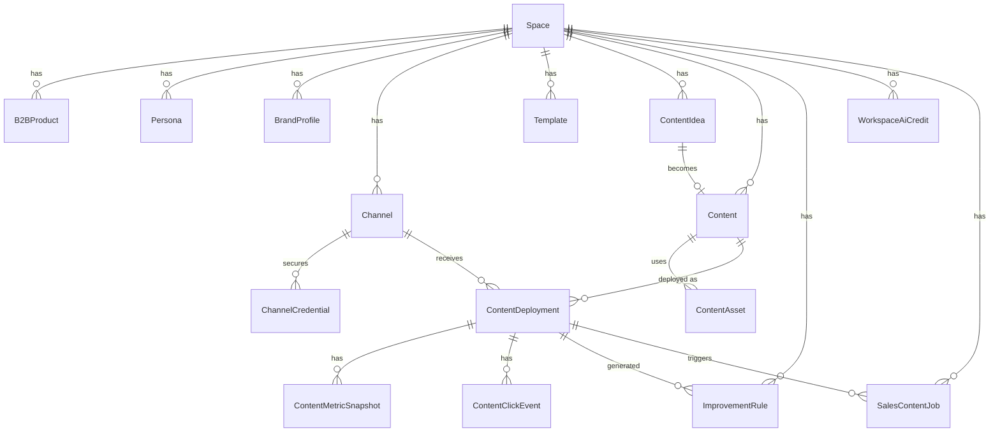
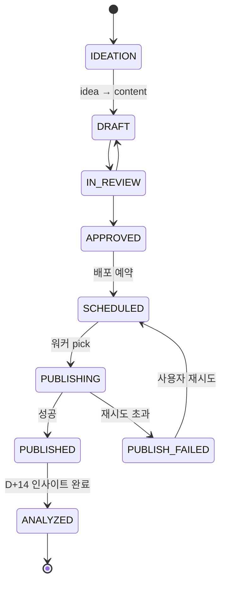
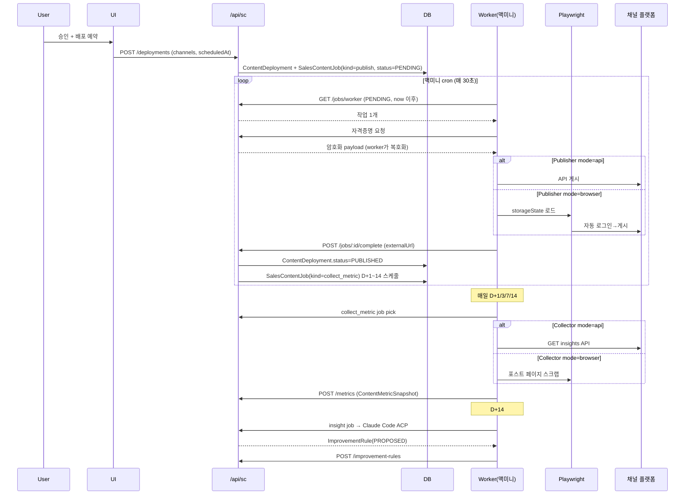

# feat: B2B 마케팅 Deck 신설 — 세일즈 콘텐츠 제작·자동 배포·성과 관리 (PoC)

> **실행 시 생성될 실제 plan 파일 경로:** `docs/plans/2026-04-24-001-feat-b2b-marketing-deck-plan.md`
> (plan mode에서 `/Users/kaleos/.claude/plans/` 외 경로를 쓸 수 없어 이 파일을 초안으로 작성. 승인 후 ce-work 단계에서 위 경로로 옮긴다.)

> **Revision 2 변경 요지 (2026-04-24 피드백 반영):**
>
> - **R2**: 외부 AI API 직접 호출 대신 **맥미니 로컬 모델 + Claude Code ACP**로 텍스트 생성. 이미지만 Gemini API 사용.
> - **R9**: 자동 퍼블리싱을 Phase 1에 재편입. API 우선, 불가 시 맥미니 24/7 워커의 **브라우저 자동화(Playwright)** 로 fallback.
> - **R13**: 성과 수집도 동일 전략(API 우선 + 브라우저 자동화 fallback). Phase 1 재편입.
> - 위 변경으로 **AIProvider·Publisher·MetricCollector** 3축 어댑터 구조가 핵심 설계가 됨.

## Overview

워크덱에 `sales-content` 라는 **3번째 Deck**을 추가한다. B2B·B2G 세일즈 리드 창출을 위한 콘텐츠를 **정보 세팅 → 아이데이션 → 제작 → 자동/반자동 배포 → 자동/반자동 성과 수집 → 자기 개선 규칙** 루프로 운영하는 제품이다.

- **제품 단계**: PoC. 확장성·안정성보다 실제 루프 동작을 우선.
- **아키텍처**: 기존 `seller-hub` Deck 패턴 (Space 격리, `resolveDeckContext`, Prisma, Supabase Auth, shadcn/ui) 재사용.
- **AI**:
  - 텍스트 생성 → **Claude Code ACP**(맥미니의 Claude Code 인스턴스 활용)가 1순위, 로컬 **Ollama**가 fallback.
  - 이미지 생성 → **Gemini API**(Imagen/Nano Banana).
- **자동화**: 맥미니에서 24/7 돌고 있는 기존 `worker/` 프로세스를 확장해 **Publisher/MetricCollector** 역할을 추가. 각 채널별로 "API 우선 → 브라우저 자동화 fallback" 2단 어댑터.

## Problem Frame

회사의 B2B/B2G 세일즈 엔진을 가속하려면 **반복 가능하고 측정 가능한** 콘텐츠 제작·배포가 필요하다. 현재:

- 아이데이션이 담당자 감에 의존 → 타겟 페르소나·상품 메시지 일관성 부족.
- 블로그·소셜 채널별 템플릿이 없어 매번 0에서 시작.
- CTA/UTM이 수작업으로 붙어 유효성·추적 정확도 낮음.
- 배포와 성과 수집이 흩어져 "다음 콘텐츠는 어떻게 써야 반응이 좋은가" 학습이 일어나지 않음.

PoC 단계에서는 1~2 워크스페이스가 실제로 이 루프를 돌리며 학습하는 데 초점을 맞춘다. 외부 클라우드 LLM 비용·심사 리스크는 자가 호스팅(맥미니) 경로로 회피한다.

## Requirements Trace

각 요구는 사용자 브리프(시나리오 1~5) + revision-2 피드백(R2/R9/R13) 원문에서 파생됐다.

- **R1. 정보 세팅** — 판매 상품·타겟 페르소나·브랜드 프로필. (브리프 1)
- **R2. AI 텍스트 생성 소스** — **맥미니의 Claude Code ACP + Ollama 로컬 모델**. 외부 LLM API 직접 호출 없음. 향후 API provider 추가 가능한 추상화만 유지.
- **R2-img. AI 이미지 생성** — Gemini API 사용 허용. 워크스페이스 월간 크레딧으로 제한.
- **R3. 채널 템플릿** — 블로그/소셜(이미지·카드뉴스·글) 기본 템플릿 + 사용자 저장/불러오기.
- **R4. 템플릿 기반 생성** — 구조에 맞춰 글·이미지 제안 생성.
- **R5. 이미지 업로드·AI 생성** — 업로드 기본, AI 생성은 크레딧 차감.
- **R6. CTA 포함** — 모든 템플릿 구조에 CTA 링크 슬롯 포함.
- **R7. 사용자 검수·수정** — 생성 결과물 편집 + 상태 전이(DRAFT→…→ANALYZED).
- **R8. UTM 자동 생성** — CTA에 `utm_source/medium/campaign` 자동 부착, 오버라이드 가능.
- **R9. 채널별 자동 배포 (Phase 1 포함)** — 플랫폼 공식 API 사용 가능 시 API로, 불가 시 맥미니 워커의 **Playwright 브라우저 자동화**로 게시. 채널별로 어느 경로를 쓰는지 플래그로 관리.
- **R10. 콘텐츠 목록·상태 관리.**
- **R11. 성과 대시보드** — 블로그(조회수/방문수/CTR), 소셜(조회수/참여수/참여율) 채널별.
- **R12. UTM 자체 클릭 집계** — 자체 shortSlug 리다이렉터로.
- **R13. 성과 자동 수집 (Phase 1 포함)** — API 우선, 불가 시 **브라우저 자동화 스크래핑**. 실패 시 수동 입력 fallback.
- **R14. 개선 인사이트 추출·규칙화** — 배포 후 7~14일 뒤 AI가 성과 분석 → ImprovementRule 생성.
- **R15. 규칙 사용자 수정·자동 주입** — 규칙은 편집 가능, 아이데이션·생성 프롬프트에 자동 포함 → self-improving 루프.
- **R16. Deck 등록·Space 격리** — 기존 `DeckApp/DeckInstance`, 모든 데이터 `spaceId` 스코핑.

## Scope Boundaries

### 비목표 (Non-goals)

- **영상 콘텐츠 제작** — 이미지·글·카드뉴스만.
- **외부 LLM API 텍스트 생성** — PoC 단계에선 의도적으로 제외 (R2). 어댑터 레이어만 열어둠.
- **콘텐츠 A/B 테스트 엔진** — 규칙 기반 학습만.
- **외부 CRM/MAP 연동** — HubSpot/Salesforce 없음. CTA는 외부 URL.
- **다국어 콘텐츠** — 한국어 기준.
- **자체 랜딩 페이지 빌더** — CTA는 외부 URL 가정.
- **워크스페이스간 콘텐츠 공유.**
- **엔터프라이즈급 스케일** — PoC 단계에서 1~2 Space, 최대 동시 Worker job 소수.

### Deferred to Separate Tasks

- **외부 LLM API provider** (Claude API, GPT 등): 어댑터 인터페이스만 Phase 1에서 확정, 실제 구현은 PoC 이후 필요 시.
- **자체 랜딩 페이지 빌더**.
- **콘텐츠 버전 관리/히스토리**: 현재는 수정하면 덮어쓰기, 롤백 없음.

## Context & Research

### Relevant Code and Patterns

- **Deck 패턴 레퍼런스**: `app/d/seller-hub/layout.tsx`, `app/d/seller-hub/page.tsx`.
- **Deck 경로 상수**: `src/lib/deck-routes.ts`.
- **Deck 허브 리다이렉트**: `app/d/[deckKey]/page.tsx` `DECK_ROUTES`.
- **Sidebar 섹션 그룹 패턴**: `src/components/layout/sidebar.tsx`의 `isSellerHubSidebar` 분기. 섹션 그룹핑 규칙(메모리 `feedback_ui_sidebar_unified.md`) 준수.
- **인증/권한**: `src/lib/api-helpers.ts` — `resolveDeckContext()`, `assertRole()`, `assertSameSpace()`.
- **Zod 스키마 레이아웃**: `src/lib/sh/schemas.ts`.
- **프리셋 저장 패턴**: `DelColumnMappingPreset` — 채널 템플릿 저장 모델의 원형.
- **AES-256-CBC 암호화**: `src/lib/del/encryption.ts` + `worker/src/encryption.ts` — 채널별 쿠키/세션·자동 로그인 자격증명 저장에 **재사용** (Phase 1부터).
- **기존 Worker 인프라 (핵심)**:
  - `worker/package.json`: `playwright@^1.50.0`, `node-cron@^3.0.0`, `tsx`. 이미 24/7 맥미니에서 돌고 있다는 전제.
  - `worker/src/orchestrator.ts`, `collection-scheduler.ts`, `analysis-scheduler.ts`: cron 파이프라인 레이아웃.
  - `worker/src/collector.ts`, `inventory-collector.ts`: Playwright로 쿠팡 사이트 로그인·다운로드. **새 Publisher/MetricCollector는 동일 패턴**.
  - `worker/src/api-client.ts`: `WORKER_API_KEY` + `x-worker-api-key` 헤더로 메인 앱 API 호출.
  - `worker/src/encryption.ts`: 메인 앱과 동일한 `ENCRYPTION_KEY` 공유.
- **Recharts 대시보드**: `src/components/sh/inventory/dashboard-chart.tsx`, `src/components/dashboard/campaign-chart.tsx`.
- **Space/DeckApp**: `prisma/schema.prisma`.

### Institutional Learnings

- **UI 사이드바 섹션 그룹 규칙** (메모리 `feedback_ui_sidebar_unified.md`).
- **DeckApp 수동 시딩**: 새 Deck 등록은 `prisma/seed.ts`에서.
- **seller-hub 통합 프로젝트** (메모리 `project_seller_hub_deck.md`): 여러 기능을 단일 Deck으로 통합하는 방향성과 일관.
- **Claude Code Bridge 서비스** (`~/.claude/CLAUDE.md`): 맥미니에서 port 18800에서 동작하는 양방향 Claude Code 중계 서비스가 이미 운영 중. ACP 연동 진입점 후보 — 단, Bridge는 Slack↔Claude Code 용도로 설계되었으므로 **sales-content 용 별도 엔드포인트를 파거나 신규 Bridge 라우트를 추가**할 가능성이 높음. 구현 시 사용자와 확인.

### External References

- **Claude Code ACP (Agent Client Protocol)** — Anthropic이 공개한, 외부 클라이언트가 Claude Code 인스턴스와 통신하기 위한 프로토콜. 맥미니의 Claude Code 인스턴스를 "텍스트 생성 백엔드"로 활용하기 위한 어댑터 구현 필요. 정확한 엔드포인트·메시지 포맷은 구현 단계에서 확인 (DQ1 참조).
- **Ollama** `@v0.6.3` — 이미 package.json에 있음. 로컬 GGUF 모델(예: Llama 3.1, Qwen 2.5) 호출. ACP 실패 시 fallback.
- **Gemini Imagen / Nano Banana** — 한국어 텍스트 삽입·카드뉴스 스타일 강점. `@google/generative-ai` SDK.
- **UTM 사양** — GA 표준.
- **플랫폼 퍼블리싱 경로**
  - **Threads / Instagram Graph API**: 비즈니스 계정 + Facebook 페이지 연결. API 가능 채널 → 1순위 API.
  - **LinkedIn Marketing Developer**: 앱 심사 수주~수개월 → Phase 1에선 브라우저 자동화 경로 우선, API는 승인되면 전환.
  - **네이버 블로그**: 글쓰기 Open API는 제휴 승인만 → 브라우저 자동화 1순위 (2FA/캡챠 대응 필요).
  - **티스토리**: API 중단 → 브라우저 자동화만 가능. 카카오 2FA 고려.
  - **X/Twitter**: API 비싸서 브라우저 자동화 1순위.

### Organizational Context

- 단독 제품 리더(에디) 주도. 맥미니 환경 1대 기준.

## Key Technical Decisions

- **D1. Deck key**: `sales-content` 제안. 최종 확정은 Unit 1 착수 전.
- **D2. 독립 `B2BProduct` 엔터티**: `InvProduct`와 분리. `sourceInvProductId nullable` 필드만 예약.
- **D3. 3축 어댑터 아키텍처 (revision 핵심)**:
  - `TextProvider` 인터페이스: 구현체 `ClaudeCodeACPProvider` (기본), `OllamaProvider` (fallback). 외부 API provider는 인터페이스만 열어둠.
  - `ImageProvider` 인터페이스: 구현체 `GeminiImageProvider`.
  - `Publisher` 인터페이스: 채널별 구현체 `ThreadsApiPublisher`, `InstagramApiPublisher`, `NaverBlogBrowserPublisher`, `TistoryBrowserPublisher`, `LinkedinBrowserPublisher` 등. 각 채널은 `mode: 'api' | 'browser' | 'manual'` 중 사용자가 선택.
  - `MetricCollector` 인터페이스: 동일 방식, 채널별 구현체 + mode 선택.
- **D4. 이미지 크레딧**: `WorkspaceAiCredit { spaceId, month, imageQuota, imageUsed }`. 기본 50장/월 하드 캡. 텍스트는 자가 호스팅이라 집계만 (옵션).
- **D5. Supabase Storage 버킷**: `sales-content-assets`, path `{spaceId}/content/{contentId}/{uuid}.{ext}`. 서버 라우트 경유 업로드.
- **D6. 리치 텍스트 에디터**: TipTap (Next.js 15/React 19 호환, 구조적 슬롯 편집 용이).
- **D7. UTM 생성 규칙**: `utm_source=channel.platformSlug`, `utm_medium=channel.kind`(blog/social), `utm_campaign=deployment.slug`, 사용자 오버라이드 가능. kebab-case 정규화.
- **D8. UTM 클릭 집계**: `/c/[slug]` Route Handler + 302 + fire-and-forget `ContentClickEvent` INSERT. 봇 필터 최소화.
- **D9. 개선 규칙 스코프**: `ImprovementRule.scope = 'workspace' | 'persona' | 'channel' | 'product' | 'combination'`. 프롬프트 조립 시 `workspace → product → persona → channel` 순 누적 병합, 충돌 시 `weight` 우선.
- **D10. 7/14일 인사이트 트리거**: 맥미니 24/7 worker cron 일일 스위프.
- **D11. 콘텐츠 상태 머신**: `DRAFT → IN_REVIEW → APPROVED → SCHEDULED → PUBLISHED → ANALYZED`. `APPROVED → DRAFT` 한 방향 역전만.
- **D12. API 네임스페이스**: `app/api/sc/...`.
- **D13. 채널 자격증명 저장**: `ChannelCredential { channelId, kind('cookie'|'oauth'|'apiKey'), encryptedPayload, iv, expiresAt, lastVerifiedAt }`. 기존 `src/lib/del/encryption.ts` AES-256-CBC 재사용.
- **D14. Worker→웹앱 통신**: 기존 `WORKER_API_KEY` 패턴 그대로. 신규 작업 큐는 DB-backed (별도 queue infra 불필요, PoC 단계).
- **D15. 작업 큐 테이블**: `SalesContentJob { id, spaceId, kind('publish'|'collect_metric'|'insight'), targetId, scheduledAt, startedAt, completedAt, status, attempts, error, payload(json) }`. 워커가 `scheduledAt <= now AND status = PENDING` 을 picking.
- **D16. 브라우저 세션 재사용**: Playwright storage state JSON을 `ChannelCredential` 에 암호화 저장. 만료 시 재로그인 → 로그인 실패(2FA/캡챠)는 사용자에게 "수동 재인증 필요" 알림.
- **D17. PoC 안정성 정책**: 실패는 조용히 묻히지 않음 — 각 job은 최대 재시도 2회 후 사용자 Slack/인앱 알림. 재시도 로직은 job `attempts` 필드 + 지수 백오프.

## Open Questions

### Resolved During Planning

- **Q1. MVP 범위** → 자동 퍼블리싱·성과 수집 포함. 수동 입력 fallback은 모든 경로의 최종 안전망.
- **Q2. AI 텍스트** → Claude Code ACP(1순위) + Ollama(2순위, fallback). 외부 LLM API 없음.
- **Q3. AI 이미지** → Gemini API, 월 50장 크레딧.
- **Q4. 상품** → 독립 `B2BProduct`.

### Deferred to Implementation

- **DQ1. Claude Code ACP 통신 방식 최종 확정**:
  - 옵션 A: 기존 Bridge 서비스(port 18800)에 `/sessions/sales-content-generate` 같은 전용 라우트 추가.
  - 옵션 B: Claude Code가 공식 제공하는 ACP 엔드포인트 직접 연결.
  - 옵션 C: 맥미니에서 `claude --non-interactive` CLI를 subprocess 실행하고 stdout 파싱.
  - Unit 3 착수 시 사용자와 확정. Phase 1에서는 가장 단순한 경로(아마 B 또는 C) 채택.
- **DQ2. Deck key 최종** (`sales-content` vs 대안).
- **DQ3. 채널 우선순위**: PoC 기간에는 어느 채널을 먼저 자동화할지. 제안: Threads(API) + 네이버 블로그(브라우저)로 시작 (API 심사 불필요 경로 1개씩). Unit 10 착수 전 확정.
- **DQ4. Playwright 헤드풀/헤드리스**: 캡챠·2FA 빈도에 따라 결정. 맥미니 headless 권장, 세션 만료 시 headful 수동 재인증.
- **DQ5. TipTap 확장 조합**: StarterKit + Link + Image + Placeholder + CharacterCount로 시작.
- **DQ6. Supabase Storage 버킷 생성 방식**: 대시보드 수동 1회 + docs 기록.
- **DQ7. Ollama 모델 선정**: Llama 3.1 8B 또는 Qwen 2.5 7B — 한국어 품질 기준. ACP 활용이 잘 되면 fallback만이므로 빈도 낮음.

## Output Structure

```
app/
├── api/sc/
│   ├── products/[...]/route.ts
│   ├── personas/[...]/route.ts
│   ├── brand-profile/route.ts
│   ├── ideations/[...]/route.ts
│   ├── contents/[...]/route.ts
│   ├── templates/[...]/route.ts
│   ├── channels/[...]/route.ts
│   ├── channels/[id]/credentials/route.ts
│   ├── deployments/[...]/route.ts
│   ├── metrics/[...]/route.ts
│   ├── improvement-rules/[...]/route.ts
│   ├── jobs/worker/route.ts              # 워커 큐 조회·picking
│   ├── jobs/[id]/complete/route.ts       # 워커 완료 보고
│   ├── ai/generate-text/route.ts
│   ├── ai/generate-image/route.ts
│   └── ai/credit/route.ts
├── c/[slug]/route.ts                     # UTM redirect
└── d/sales-content/
    ├── layout.tsx
    ├── page.tsx
    ├── home/page.tsx
    ├── settings/{products,personas,brand-profile}/...
    ├── ideation/...
    ├── contents/...
    ├── templates/...
    ├── channels/...                       # 채널 + 자격증명 관리
    ├── deployments/...
    ├── analytics/...
    └── rules/page.tsx

src/
├── components/sc/
│   ├── settings/..., ideation/..., editor/..., contents/...
│   ├── templates/..., channels/..., deployments/...
│   ├── analytics/..., rules/...
│   └── jobs/job-status-list.tsx           # 진행 중 작업 표시
└── lib/
    ├── sc/
    │   ├── schemas.ts, utm.ts, prompts.ts
    │   ├── template-engine.ts, improvement.ts
    │   └── jobs.ts                        # 큐 enqueue 헬퍼
    └── ai/
        ├── providers/
        │   ├── index.ts                   # TextProvider/ImageProvider factory
        │   ├── text-claude-code-acp.ts
        │   ├── text-ollama.ts
        │   └── image-gemini.ts
        └── credit.ts

worker/src/
├── sc/
│   ├── job-poller.ts                      # 통합 큐 poller
│   ├── browser-pool.ts                    # Playwright 인스턴스 관리·storageState 로드
│   ├── publishers/
│   │   ├── index.ts                       # Publisher factory
│   │   ├── threads-api.ts
│   │   ├── instagram-api.ts
│   │   ├── naver-blog-browser.ts
│   │   ├── tistory-browser.ts
│   │   ├── linkedin-browser.ts
│   │   └── threads-browser.ts             # API 실패 시 fallback
│   ├── collectors/
│   │   ├── index.ts
│   │   ├── threads-api.ts
│   │   ├── instagram-api.ts
│   │   ├── naver-blog-browser.ts
│   │   ├── tistory-browser.ts
│   │   ├── linkedin-browser.ts
│   │   └── utm-aggregator.ts              # ContentClickEvent 집계
│   └── insight-generator.ts               # D+7/14 인사이트
├── sc-api-client.ts                       # 메인 앱 sc 네임스페이스 호출 래퍼
└── (기존 파일 유지)

prisma/migrations/<timestamp>-feat-sales-content/
```

## High-Level Technical Design

> **방향성을 전달하기 위한 지침이며 구현 스펙이 아니다. 구현 에이전트는 참고만 하고 동등한 결과를 내는 한 자유롭게 코드를 구성해도 좋다.**

### 1. 시스템 전체 구성

```mermaid
flowchart LR
    subgraph Web["웹앱 (Next.js)"]
        UI[Deck UI]
        API[/api/sc/*]
    end
    subgraph MacMini["맥미니 24/7 환경"]
        CCACP[Claude Code ACP]
        Ollama[Ollama]
        Worker[Worker 프로세스]
        Playwright[Playwright 브라우저]
        Worker --> Playwright
    end
    subgraph External["외부"]
        Gemini[Gemini API]
        Platforms[(플랫폼 API/사이트)]
    end
    DB[(PostgreSQL)]
    Storage[(Supabase Storage)]

    UI <--> API
    API <--> DB
    API <--> Storage
    API -- ACP --> CCACP
    API -- HTTP --> Ollama
    API -- HTTPS --> Gemini
    Worker -- poll/report --> API
    Worker -- HTTPS --> Platforms
    Playwright -- 자동화 --> Platforms
```

### 2. 데이터 모델 (ERD 축약)



주요 테이블:

- `B2BProduct`, `Persona`, `BrandProfile` (R1)
- `Channel { id, spaceId, platform, kind, display, defaultTemplateId, platformSlug, publisherMode, collectorMode }`
- `ChannelCredential { channelId, kind, encryptedPayload, iv, expiresAt, lastVerifiedAt, lastError }` (D13)
- `Template`, `ContentIdea`, `Content`, `ContentAsset`
- `ContentDeployment { contentId, channelId, deployedAt, externalUrl, shortSlug, status, note, publishedByJobId }`
- `ContentMetricSnapshot { deploymentId, capturedAt, source(MANUAL|UTM|PLATFORM_API|BROWSER_SCRAPE), impressions, visits, ctr, likes, comments, shares, reposts, engagementRate }`
- `ContentClickEvent`
- `ImprovementRule`, `WorkspaceAiCredit`
- `SalesContentJob` (D15)

### 3. 콘텐츠 상태 전이



### 4. 자동 배포·수집 루프



### 5. AIProvider / Publisher / Collector 어댑터 의사-시그니처

```
interface TextProvider {
  name: string                         // 'claude-code-acp' | 'ollama' | ...
  generate(input: {
    system: string
    messages: Message[]
    responseFormat?: 'json' | 'text'
    maxTokens?: number
  }): Promise<{ content: string; usage?: Usage }>
}

interface ImageProvider {
  name: string                         // 'gemini-imagen'
  generate(input: {
    prompt: string
    aspectRatio: '1:1' | '4:5' | '16:9'
    style?: string
    n?: number
  }): Promise<{ assets: Array<{ bytes: Buffer; mime: string }>; cost?: Decimal }>
}

interface Publisher {
  platform: Platform
  mode: 'api' | 'browser'
  publish(input: {
    content: ContentExport       // 채널별 포맷 (blog-md, social-text, cardnews-zip)
    credential: DecryptedCredential
    channel: Channel
  }): Promise<{ externalUrl: string; externalId?: string }>
}

interface MetricCollector {
  platform: Platform
  mode: 'api' | 'browser'
  collect(input: {
    deployment: ContentDeployment
    credential: DecryptedCredential
    since?: Date
  }): Promise<ContentMetricSnapshot>
}

function getTextProvider(): TextProvider              // 기본 ACP, fallback Ollama
function getImageProvider(): ImageProvider            // Gemini
function getPublisher(channel: Channel): Publisher    // channel.publisherMode 기반
function getCollector(channel: Channel): MetricCollector
```

> 주의: 구현 시 실제 SDK 시그니처·에러 포맷으로 매핑. 위는 방향성.

### 6. UTM 빌더 의사-코드

```
function buildTrackedUrl(targetUrl, channel, deployment, userOverrides) {
  const utm = {
    utm_source: slug(userOverrides.source ?? channel.platformSlug),
    utm_medium: slug(userOverrides.medium ?? channel.kind),
    utm_campaign: slug(userOverrides.campaign ?? deployment.slug),
    ...(userOverrides.content ? { utm_content: slug(userOverrides.content) } : {}),
  }
  return appendParams(targetUrl, utm)
}
// 앱 내부 리다이렉터: {APP_URL}/c/{deployment.shortSlug} → 302 + ContentClickEvent INSERT
```

## Implementation Units

**Phase 1 (PoC)** 13 단위. 의존 그래프: 1→(2,3,5)→4→6→(7,8)→(9,11)→(10,12)→13.

- [ ] **Unit 1: Deck 등록·라우팅·사이드바 스켈레톤**

**Goal:** `sales-content` Deck이 `/d/sales-content/...`로 접근 가능, 6섹션 사이드바(정보·아이데이션·콘텐츠·템플릿·채널·성과·규칙).

**Requirements:** R16, (DQ2 확정)

**Dependencies:** 없음.

**Files:**

- Create: `app/d/sales-content/{layout,page}.tsx`, `app/d/sales-content/home/page.tsx`
- Modify: `app/d/[deckKey]/page.tsx` (`DECK_ROUTES`에 등록)
- Modify: `src/lib/deck-routes.ts` (`SALES_CONTENT_*` 상수군)
- Modify: `src/components/layout/sidebar.tsx` (variant `sales-content`)
- Modify: `prisma/seed.ts` (DeckApp INSERT)
- Test: (없음 — 스켈레톤)

**Approach:** seller-hub layout 복제 + `resolveDeckContext('sales-content')`. 섹션 그룹 규칙 준수.

**Patterns to follow:** `app/d/seller-hub/layout.tsx`, `sidebar.tsx`의 `isSellerHubSidebar` 블록.

**Test scenarios:**

- Happy path: 로그인 Space 멤버 `/d/sales-content` → `/home` 리다이렉트, 사이드바 섹션 노출.
- Edge case: DeckInstance 비활성 → 활성화 유도 화면.
- Error path: 미인증 → `/login`.
- Test expectation: 자동 테스트 없음 (pure scaffolding). 수동 시각 검증.

**Verification:** seed 실행 후 UI 진입. `npm run lint && npm run build` 통과.

- [ ] **Unit 2: 정보 세팅 도메인 모델 + CRUD**

**Goal:** `B2BProduct`, `Persona`, `BrandProfile` CRUD.

**Requirements:** R1

**Dependencies:** Unit 1.

**Files:**

- Modify: `prisma/schema.prisma` (3개 모델, 모두 `spaceId` FK, `slug` unique-per-space)
- Create: `src/lib/sc/schemas.ts` (zod)
- Create: `app/api/sc/products/{route.ts,[id]/route.ts}`, 동일 패턴 personas, brand-profile(단일 레코드 upsert)
- Create: `src/components/sc/settings/{product-form,product-list,persona-form,persona-list,brand-profile-form}.tsx`
- Create: `app/d/sales-content/settings/{products,personas,brand-profile}/...` 페이지
- Test: `src/lib/sc/__tests__/schemas.test.ts`, `src/components/sc/settings/__tests__/product-form.test.tsx`

**Approach:** react-hook-form + zod. 긴 자유 텍스트 textarea, 배열 필드는 chip input. `B2BProduct.sourceInvProductId` 필드 예약, UI 비노출.

**Patterns to follow:** `src/components/sh/products/product-basic-form.tsx`, `app/api/sh/products/route.ts`, `src/lib/sh/schemas.ts`.

**Test scenarios:**

- Happy: 상품 생성·수정·삭제, 목록 반영.
- Edge: slug 중복(동일 Space) → 400.
- Error: cross-space 접근 → `assertSameSpace` 403.
- Integration: 페르소나 저장이 Unit 4 프롬프트에 반영됨 (Unit 4 테스트에서 확인).

**Verification:** `npx prisma migrate dev --name feat-sc-settings`. UI에서 CRUD 전부 동작.

- [ ] **Unit 3: AIProvider 어댑터 — Claude Code ACP + Ollama + Gemini**

**Goal:** `TextProvider`·`ImageProvider` 인터페이스 + 맥미니 ACP/Ollama/Gemini 구현체 + 이미지 크레딧 시스템.

**Requirements:** R2, R2-img, R5, D3, D4

**Dependencies:** Unit 1.

**Files:**

- Modify: `prisma/schema.prisma` (`WorkspaceAiCredit`, `ImageGenerationLog`, `TextGenerationLog`(optional))
- Create: `src/lib/ai/providers/{index,text-claude-code-acp,text-ollama,image-gemini}.ts`
- Create: `src/lib/ai/credit.ts` (`reserveImageCredit`, `commitImageCredit`, `getMonthUsage`, `refundImageCredit`)
- Create: `app/api/sc/ai/{generate-text,generate-image,credit}/route.ts`
- Modify: `.env.local.example` (`CLAUDE_CODE_ACP_ENDPOINT`, `OLLAMA_ENDPOINT`, `GOOGLE_AI_API_KEY`, `SALES_CONTENT_IMAGE_MONTHLY_QUOTA=50`)
- Install: `@google/generative-ai`
- Test: `src/lib/ai/__tests__/credit.test.ts`, `src/lib/ai/providers/__tests__/text-claude-code-acp.test.ts` (mock transport 기준)

**Approach:**

- **ClaudeCodeACPProvider**: DQ1에서 확정된 엔드포인트로 HTTP POST. 요청=시스템프롬프트+메시지+responseFormat, 응답=content+간단 usage. Bridge 라우트(`http://127.0.0.1:18800/...`) 활용 가능성 높음.
- **OllamaProvider**: `OLLAMA_ENDPOINT/api/chat` 표준 호출. ACP 실패 시 factory가 fallback.
- **Factory 결정 규칙**: 환경변수 우선순위 + DB 플래그(Space 단위 override 가능). ACP healthcheck 실패 N회 → 일시적 Ollama 전환 + alert.
- **ImageGemini**: `@google/generative-ai`의 Imagen 또는 Nano Banana 엔드포인트. 결과 바이트를 반환(저장은 호출자 Unit 7 책임).
- **Credit 2-phase**: reserve→commit, 실패 시 refund.

**Patterns to follow:** `src/lib/ai/prompts.ts` 프롬프트 조립 패턴.

**Test scenarios:**

- Happy: ACP 정상 → Claude 응답 반환.
- Edge: ACP 헬스체크 실패 → Ollama fallback 자동 동작.
- Error: Gemini 5xx → reserved credit 롤백.
- Error: 크레딧 소진 → 403 `CREDIT_EXCEEDED`.
- Integration: Unit 4·6에서 이 provider가 호출되어 실제 생성 결과가 DB에 남는다.

**Verification:** 로컬 맥미니 ACP 엔드포인트 연결 확인. Gemini 호출로 실제 이미지 생성(1장). 크레딧 증감 확인.

- [ ] **Unit 4: 아이데이션 (글감 후보 생성)**

**Goal:** 세팅값 + 사용자 프롬프트 → Claude Code ACP로 글감 후보 N개 생성.

**Requirements:** R2, R15 (규칙 주입 지점)

**Dependencies:** Unit 2, 3.

**Files:**

- Modify: `prisma/schema.prisma` (`ContentIdea`)
- Create: `src/lib/sc/prompts.ts` (ideation prompt builder, 활성 ImprovementRule 병합 호출)
- Create: `app/api/sc/ideations/{route,[id]/route}.ts`
- Create: `src/components/sc/ideation/{ideation-form,idea-card,idea-list}.tsx`
- Create: `app/d/sales-content/ideation/{page,[id]/page}.tsx`
- Test: `src/lib/sc/__tests__/prompts.test.ts` (프롬프트에 제품·페르소나·규칙이 포함되는지)

**Approach:** JSON schema 지시 (`{ ideas: [...] }`). `promptTrace`에 프롬프트 해시·규칙 id 스냅샷 기록. 사용자 수동 작성은 `generatedBy=USER`.

**Patterns to follow:** `src/lib/ai/prompts.ts`.

**Test scenarios:**

- Happy: 상품1+페르소나1 → 후보 5개 + DB 저장.
- Edge: 상품·페르소나 미선택 → 400.
- Error: ACP 타임아웃 → retry 1회 → 실패 메시지.
- Integration: 활성 ImprovementRule 주입 확인.

**Verification:** 실제 맥미니 Claude Code ACP 호출로 5개 후보 UI 표시.

- [ ] **Unit 5: 템플릿 시스템 (시스템 기본 + 사용자 저장)**

**Goal:** 채널별 기본 템플릿 + 사용자 커스텀.

**Requirements:** R3

**Dependencies:** Unit 1.

**Files:**

- Modify: `prisma/schema.prisma` (`Template`, `Channel` 기본부)
- Modify: `prisma/seed.ts` (시스템 템플릿 3종: 블로그 장문, 소셜 텍스트, 카드뉴스)
- Create: `src/lib/sc/template-engine.ts`
- Create: `app/api/sc/templates/{route,[id]/route}.ts`, `channels/{route,[id]/route}.ts`
- Create: `src/components/sc/templates/{template-list,template-form,template-preview}.tsx`, `channels/channel-form.tsx`
- Create: `app/d/sales-content/templates/{page,[id]/page,new/page}.tsx`, `channels/{page,[id]/page}.tsx`
- Test: `src/lib/sc/__tests__/template-engine.test.ts`

**Approach:** Template `sections: [{ key, kind: 'text'|'imageSlot'|'cta', label, guidance, constraints }]`. 카드뉴스는 `slides[]`. 채널은 platform(enum) + kind(blog/social) + publisherMode('api'|'browser'|'manual') + collectorMode.

**Patterns to follow:** `DelColumnMappingPreset` 저장 패턴.

**Test scenarios:**

- Happy: 시스템 템플릿 복제→편집→저장.
- Edge: isSystem=true 직접 수정 → 403.
- Error: 섹션 구조 zod 위반 → 400.
- Integration: Unit 6에서 skeleton 변환에 사용됨.

**Verification:** 시스템 템플릿 3종 seed. 복제/편집 UI 동작.

- [ ] **Unit 6: 콘텐츠 제작 — 본문 생성 + TipTap 에디터 + 상태 머신**

**Goal:** idea+template → 본문 skeleton + AI 섹션 주입 + TipTap 편집 + 상태 전이.

**Requirements:** R4, R7, R11 상태 전이

**Dependencies:** Unit 4, 5, 3.

**Files:**

- Modify: `prisma/schema.prisma` (`Content`, `ContentAsset`)
- Install: `@tiptap/react`, `@tiptap/starter-kit`, `@tiptap/extension-link`, `@tiptap/extension-image`, `@tiptap/extension-placeholder`, `@tiptap/extension-character-count`
- Create: `src/components/sc/editor/{editor,toolbar,image-slot,cta-slot}.tsx`
- Create: `src/components/sc/contents/{content-form,content-list,content-status-badge}.tsx`
- Create: `app/api/sc/contents/{route,[id]/route,[id]/generate/route,[id]/transition/route}.ts`
- Create: `app/d/sales-content/contents/{page,[id]/page,[id]/edit/page,new/page}.tsx`
- Test: `src/components/sc/editor/__tests__/editor.test.tsx`, `app/api/sc/contents/__tests__/transition.test.ts`

**Approach:** 생성 흐름: Content 생성 시 `templateId+ideaId` skeleton(JSON Doc) → 섹션별 Claude 호출. 이미지 슬롯은 TipTap 노드(AI 생성/업로드/건너뛰기 액션, Unit 7·8 연동). 상태 전이 API는 허용된 전환만 수락.

**Patterns to follow:** shadcn Dialog/Form + seller-hub 폼 분리.

**Test scenarios:**

- Happy: idea→content 전환 skeleton 저장.
- Edge: 빈 본문 저장은 DRAFT 허용, IN_REVIEW 전환 시 최소 길이 검증.
- Error: 비허용 상태 전이 → 400.
- Integration: 이미지 슬롯에서 Unit 7 호출 시 ContentAsset 연결.

**Verification:** 로컬 UI에서 생성·편집·상태 전이.

- [ ] **Unit 7: 이미지 업로드 & AI 생성 — Supabase Storage**

**Goal:** 업로드 + Gemini AI 생성, Supabase Storage 저장.

**Requirements:** R4(이미지 제안·규격), R5

**Dependencies:** Unit 3, 6.

**Files:**

- Create: `src/lib/supabase/storage.ts`
- Create: `src/components/sc/editor/image-picker.tsx`
- Create: `app/api/sc/contents/[id]/assets/route.ts`
- Docs: 버킷 생성 절차 기록 (DQ6)
- Test: `src/lib/supabase/__tests__/storage.test.ts`

**Approach:** 버킷 `sales-content-assets`, public-read. 경로 `{spaceId}/content/{contentId}/{uuid}.{ext}`. 서버 라우트 경유 업로드. AI 생성은 Gemini 바이트 → Storage put → ContentAsset INSERT.

**Test scenarios:**

- Happy: 업로드 → 에셋 생성·삽입.
- Edge: 20MB 초과 → 413.
- Error: 크레딧 소진 시 AI 생성 → 403, 업로드 fallback 안내.
- Integration: ContentAsset 삭제 시 Storage 오브젝트도 제거.

**Verification:** Supabase Storage 실제 파일 확인.

- [ ] **Unit 8: UTM 빌더 + `/c/[slug]` 리다이렉터**

**Goal:** CTA UTM 자동 부착 + 자체 클릭 집계.

**Requirements:** R6, R8, R12

**Dependencies:** Unit 6.

**Files:**

- Create: `src/lib/sc/utm.ts`
- Modify: `prisma/schema.prisma` (`ContentDeployment.shortSlug` unique, `ContentClickEvent`)
- Create: `app/c/[slug]/route.ts`
- Create: `src/components/sc/contents/utm-override-form.tsx`
- Modify: `src/components/sc/editor/cta-slot.tsx`
- Test: `src/lib/sc/__tests__/utm.test.ts`, `app/c/[slug]/__tests__/redirect.test.ts`

**Approach:** 렌더 시 CTA는 `{APP_URL}/c/{shortSlug}` 로 치환. 내부 DB에 오리지널+UTM 스펙 저장. 리다이렉터는 302 + fire-and-forget `ContentClickEvent` INSERT. IP는 SHA-256 + salt.

**Test scenarios:**

- Happy: CTA 입력 → UTM 자동 → shortSlug 변환 → 302 + 이벤트 기록.
- Edge: 사용자 utm_campaign 오버라이드 반영.
- Error: 유효하지 않은 slug → 404.
- Integration: N회 클릭 → Unit 10의 UTM 집계에 반영.

**Verification:** 실제 클릭 후 ContentClickEvent row 확인.

- [ ] **Unit 9: 채널 자격증명 관리 + 작업 큐 + 워커 스켈레톤**

**Goal:** `ChannelCredential` 암호화 저장 + `SalesContentJob` 큐 + 맥미니 워커가 큐를 polling하는 기본 골격.

**Requirements:** R9, R13, D13, D14, D15, D16

**Dependencies:** Unit 5 (Channel 모델).

**Files:**

- Modify: `prisma/schema.prisma` (`ChannelCredential`, `SalesContentJob`)
- Create: `src/lib/sc/jobs.ts` (enqueue/dequeue 헬퍼)
- Create: `app/api/sc/channels/[id]/credentials/route.ts` (POST=암호화 저장, DELETE)
- Create: `app/api/sc/jobs/worker/route.ts` (GET: `x-worker-api-key` 인증, `scheduledAt<=now AND status=PENDING` N개 claim)
- Create: `app/api/sc/jobs/[id]/complete/route.ts` (POST: 성공/실패 보고)
- Create: `src/components/sc/channels/credential-form.tsx` (쿠키/OAuth/APIKey 3-type 폼)
- Modify: `worker/src/index.ts` (새 poller 등록)
- Create: `worker/src/sc/job-poller.ts`, `worker/src/sc/browser-pool.ts`, `worker/src/sc-api-client.ts`
- Modify: `worker/src/encryption.ts` (재사용 확인, 이미 있음)
- Modify: `worker/package.json` (필요 시 dependencies 조정)
- Test: `app/api/sc/jobs/__tests__/worker-claim.test.ts` (동시 클레임 레이스 방지)

**Approach:**

- Job claim은 `UPDATE ... WHERE status='PENDING' AND scheduledAt<=now RETURNING ...` 단일 쿼리로 atomic.
- attempts 증가, 실패 시 지수 백오프(1m/5m/15m) 후 재시도, 2회 초과 시 FAILED + 사용자 알림.
- 브라우저풀: Playwright 단일 `chromium.launchPersistentContext` (userDataDir per-channel) 우선. storageState JSON은 `ChannelCredential.encryptedPayload`에.
- 자격증명 수동 입력 UI: "쿠키 JSON 붙여넣기" 또는 "워커 헤드풀로 로그인(초기)". 초기 로그인은 나중(필요 시) 수동 명령 `tsx worker/src/sc/login.ts --channel=...`.

**Patterns to follow:** `worker/src/api-client.ts`(worker-key 헤더), `worker/src/orchestrator.ts`(pipeline), `src/lib/del/encryption.ts` AES-256-CBC.

**Test scenarios:**

- Happy: 작업 enqueue → 워커 claim → complete 보고 → status=COMPLETED.
- Edge: 2개 워커 동시 claim → atomic 쿼리로 하나만 성공.
- Error: worker complete에서 실패 보고 → attempts++, 지수 백오프로 재스케줄.
- Integration: 자격증명 저장 후 워커가 복호화해 사용 가능.

**Verification:** 시뮬 job 1개를 enqueue 후 로컬 워커 `npm run dev`로 claim/complete 확인.

- [ ] **Unit 10: 배포 실행 — Publishers (API + 브라우저 자동화)**

**Goal:** 채널 선택·배포 예약 + 워커가 실제 게시 수행. API 우선, 불가 시 Playwright 브라우저 자동화.

**Requirements:** R9

**Dependencies:** Unit 6, 7, 8, 9.

**Files:**

- Modify: `prisma/schema.prisma` (`ContentDeployment` 확정)
- Create: `app/api/sc/deployments/{route,[id]/route}.ts`
- Create: `src/components/sc/deployments/{deploy-wizard,deployment-list}.tsx`
- Create: `app/d/sales-content/deployments/{page,[id]/page}.tsx`
- Create: `src/lib/sc/exporters/{blog-markdown,social-text,cardnews-zip}.ts` (export 포맷터)
- Create: `worker/src/sc/publishers/index.ts` (factory)
- Create: `worker/src/sc/publishers/{threads-api,instagram-api,naver-blog-browser,tistory-browser,linkedin-browser,threads-browser}.ts` (DQ3 우선순위 채널부터)
- Test: `src/lib/sc/exporters/__tests__/blog-markdown.test.ts`, `worker/src/sc/publishers/__tests__/naver-blog-browser.test.ts` (Playwright 로컬 페이지로 smoke)

**Approach:**

- 배포 예약 저장 시 `SalesContentJob(kind='publish', scheduledAt, payload={deploymentId})` enqueue.
- 워커가 claim → `getPublisher(channel)` → publish. API publisher는 플랫폼 SDK 호출. Browser publisher는 `browser-pool`에서 context 빌려 자동화.
- 실패 시 Unit 9 재시도 정책. 2회 실패 시 `Deployment.status=PUBLISH_FAILED` + 사용자 알림.
- **수동 모드**는 항상 유지 — UI에서 `publisherMode='manual'` 선택 시 워커 skip, 사용자가 외부 URL 수동 입력.
- **초기 채널 커버리지 (DQ3 기본안)**:
  - API: Threads, Instagram (Meta Graph API)
  - Browser: 네이버 블로그, 티스토리, LinkedIn (승인 전)
  - X/Twitter, Threads-browser는 API 대체재로 준비

**Patterns to follow:** `worker/src/collector.ts` Playwright 구조, `worker/src/inventory-collector.ts`.

**Test scenarios:**

- Happy (API): Threads 예약 → 워커 claim → API 호출 성공 → externalUrl 저장.
- Happy (Browser): 네이버 블로그 예약 → Playwright 자동 로그인(저장된 쿠키) → 글 작성·게시 → externalUrl 저장.
- Edge: 세션 만료 → `ChannelCredential.lastError` 기록 + 사용자에게 "재로그인 필요" 알림.
- Edge: 캡챠 발생 → 즉시 fail + headful 수동 개입 요청.
- Error: 재시도 2회 초과 → PUBLISH_FAILED.
- Edge: 동일 콘텐츠 여러 채널 동시 배포 → 각 deployment 독립 job.
- Integration: 성공 시 Unit 12의 수집 잡이 D+1/3/7/14로 자동 enqueue.

**Verification:** 테스트 계정(더미 네이버 블로그)으로 1건 실제 게시 확인. Threads API sandbox로 1건 확인.

- [ ] **Unit 11: 성과 대시보드 — 수동 입력 + UTM 집계 UI**

**Goal:** 콘텐츠 목록·필터·상태 관리 + 배포별 성과 대시보드(채널별 KPI). 자동 수집 이전에 수동 입력 경로 확보.

**Requirements:** R10, R11, R12

**Dependencies:** Unit 8, 10.

**Files:**

- Modify: `prisma/schema.prisma` (`ContentMetricSnapshot` + `source` enum 확정)
- Create: `app/api/sc/metrics/{route,[deploymentId]/route}.ts`
- Create: `src/components/sc/analytics/{metric-input-form,deployment-kpi,trend-chart,metric-source-badge}.tsx`
- Create: `app/d/sales-content/analytics/{page,[deploymentId]/page}.tsx`
- Create: `worker/src/sc/collectors/utm-aggregator.ts` (매일 1회 ContentClickEvent → MetricSnapshot(source=UTM) upsert)
- Test: `src/components/sc/analytics/__tests__/metric-input-form.test.tsx`, `worker/src/sc/collectors/__tests__/utm-aggregator.test.ts`

**Approach:**

- MetricSnapshot `source` 다원화: `MANUAL|UTM|PLATFORM_API|BROWSER_SCRAPE`. 대시보드에서 source별 배지 표시.
- CTR 계산: `visits/impressions` (source 혼합 — impressions는 MANUAL/PLATFORM_API/BROWSER_SCRAPE 중 최신, visits는 UTM 우선).
- 차트: 배포 기준 D+1/3/7/14 시점 스냅샷 트렌드.

**Patterns to follow:** `src/components/sh/inventory/dashboard-chart.tsx`.

**Test scenarios:**

- Happy: 수동 impressions 1000 + UTM 30 → CTR 3% 표시.
- Edge: impressions 없음 → CTR "—".
- Error: 음수 입력 → zod 실패.
- Integration: UTM 집계 worker 실행 후 대시보드 반영.

**Verification:** 실제 배포 1건에 대해 수동·UTM 데이터 모두 반영 확인.

- [ ] **Unit 12: 성과 자동 수집 — Collectors (API + 브라우저 자동화)**

**Goal:** 배포 후 D+1/3/7/14 자동 수집. 채널 API 가능 시 API, 불가 시 브라우저 자동화.

**Requirements:** R13

**Dependencies:** Unit 10, 11, 9.

**Files:**

- Create: `worker/src/sc/collectors/index.ts` (factory)
- Create: `worker/src/sc/collectors/{threads-api,instagram-api,naver-blog-browser,tistory-browser,linkedin-browser}.ts`
- Modify: `worker/src/sc/job-poller.ts` (kind='collect_metric' 처리)
- Modify: `app/api/sc/metrics/route.ts` (워커가 POST 가능하도록 `x-worker-api-key` 지원)
- Modify: `app/api/sc/jobs/[id]/complete/route.ts` (collect_metric 결과 handling)
- Test: `worker/src/sc/collectors/__tests__/naver-blog-browser.test.ts` (스크랩 파서 단독 테스트용 HTML 픽스처)

**Approach:**

- 배포 성공(Unit 10) 시 4개 `collect_metric` job 자동 enqueue (D+1/3/7/14).
- API collector: Graph Insights API 호출 → MetricSnapshot upsert(source=PLATFORM_API).
- Browser collector: 공개 포스트 페이지 접근 → 좋아요/댓글/조회수 DOM 파싱 → MetricSnapshot upsert(source=BROWSER_SCRAPE). 로그인 필요한 지표(노출수 등)는 관리자 페이지 스크랩 (세션 필요).
- 스크랩 파서는 **픽스처 기반 단위 테스트**로 회귀 방지.

**Test scenarios:**

- Happy: 배포 성공 → 4개 job 자동 enqueue → D+1에 1회 수집 → MetricSnapshot 저장.
- Edge: 포스트 삭제 → 404 → `Deployment.note="externally_deleted"` + 이후 수집 skip.
- Error: 플랫폼 UI 변경으로 파서 깨짐 → 상세 에러 로그 + alert, 사용자에게 수동 입력 권유.
- Integration: 대시보드(Unit 11)에 PLATFORM_API/BROWSER_SCRAPE source로 표기.

**Verification:** 더미 계정 배포 후 D+1 지표가 자동으로 대시보드에 등장.

- [ ] **Unit 13: 개선 규칙 생성·관리 — 셀프-임프루빙 루프**

**Goal:** D+14 시점 Claude Code ACP가 성과 분석 → `ImprovementRule`(PROPOSED) 생성 → 승인→ACTIVE → 아이데이션·생성 프롬프트에 자동 주입.

**Requirements:** R14, R15

**Dependencies:** Unit 4, 11, 12.

**Files:**

- Modify: `prisma/schema.prisma` (`ImprovementRule`)
- Create: `src/lib/sc/improvement.ts` (병합·프롬프트 주입)
- Modify: `src/lib/sc/prompts.ts` (아이데이션/생성에서 병합된 활성 규칙 사용)
- Create: `worker/src/sc/insight-generator.ts` (job kind='insight' 처리)
- Create: `app/api/sc/improvement-rules/{route,[id]/route}.ts`
- Create: `src/components/sc/rules/{rule-list,rule-form,rule-preview}.tsx`
- Create: `app/d/sales-content/rules/page.tsx`
- Test: `src/lib/sc/__tests__/improvement.test.ts`, `worker/src/sc/__tests__/insight-generator.test.ts`

**Approach:**

- D+14 수집 완료 시 `insight` job enqueue.
- 워커가 Claude Code ACP에 `deployment + 최근 N개 historic 메트릭 + 콘텐츠 스펙` 전달 → `{rules:[{scope,targetIds,title,body,evidenceDeploymentIds,weight}]}` 반환.
- 병합: `workspace → product → persona → channel`, 충돌 `weight` 우선, 동률 `updatedAt`.
- 사용자 직접 작성도 가능 (`source=USER`).

**Test scenarios:**

- Happy: D+14 도달 → Claude Code ACP 호출 → Rule PROPOSED 생성.
- Edge: 메트릭 부족 → skip + 로그.
- Error: ACP 에러 → 1회 재시도 → 사용자 알림.
- Integration: ACTIVE 규칙이 Unit 4 ideation의 `promptTrace`에 등장. 사용자 편집 즉시 반영.

**Verification:** 시드 + D+14 시점 시뮬레이션으로 Rule INSERT 확인. 편집→다음 아이데이션에서 trace 반영.

## System-Wide Impact

- **Interaction graph**:
  - `my-deck` 목록 → 새 DeckApp 자동 반영.
  - Middleware → `/d/sales-content`는 기존 보호 경로 정책, `/c/[slug]`는 공개 경로.
  - **Worker 프로세스** → `worker/src/sc/*` 하위 모듈 추가. 기존 쿠팡·재고 수집 파이프라인과 **같은 프로세스**에서 공존.
  - **맥미니 로컬 서비스**: Claude Code ACP 엔드포인트·Ollama 엔드포인트가 항상 살아있어야 함 (헬스체크 필요).
- **Error propagation**: 모든 AI 호출 실패는 사용자에게 명시 + 부작용(크레딧) 롤백. 워커 잡 실패는 재시도 후 알림 + UI 상태 표시.
- **State lifecycle risks**:
  - 콘텐츠 상태: 단일 transition API.
  - 작업 큐: atomic claim, 멱등성(completed 이후 중복 보고 무시).
  - 자격증명: 만료 감지·재로그인 요청.
- **API surface parity**: 에이전트-네이티브 규칙 — 모든 CRUD·상태 전이·배포 예약은 HTTP API로 수행 가능.
- **Integration coverage**: 전체 루프(아이데이션→콘텐츠→배포→클릭→수집→규칙→다음 아이데이션) smoke test를 `scripts/sc-e2e-smoke.ts`로.
- **Unchanged invariants**:
  - 기존 `seller-hub`·`coupang-ads` 동작 불변.
  - 기존 `worker` 프로세스는 여전히 쿠팡 수집 담당. Sales-content 잡은 별도 poller로 독립.
  - `ENCRYPTION_KEY`는 기존 것을 그대로 공유 (채널 자격증명 저장에 재사용).

## Risks & Dependencies

| 리스크                                      | 대응                                                                                               |
| ------------------------------------------- | -------------------------------------------------------------------------------------------------- |
| **Claude Code ACP 통신 방식 불확실** (DQ1)  | Unit 3 초반에 3옵션 프로토타입 → 가장 안정적인 경로 채택. Ollama fallback이 항상 존재.             |
| **맥미니 단일 장애 지점**                   | 워커 crash 감지(기존 PM2 ecosystem.config.cjs) + systemd 재시작. 장기적으로 2대 이중화는 PoC 이후. |
| **브라우저 자동화가 플랫폼 UI 변경에 취약** | 파서는 픽스처 기반 테스트 + 실패 시 즉시 alert. PoC이므로 허용 가능한 리스크.                      |
| **플랫폼 약관 위반 가능성** (특히 자동화)   | 테스트 계정 위주로 PoC. 상업 확대 전 각 플랫폼 약관·자동화 허용 범위 법적 검토.                    |
| **2FA·캡챠 빈도**                           | 세션 storageState 장기 유지 + 만료 시 수동 재인증. headful 모드 로그인 스크립트 준비.              |
| **이미지 토큰 비용 폭증**                   | 월 50장 하드 캡. 사용량 대시보드.                                                                  |
| **JSON 스키마 출력 불안정 (특히 Ollama)**   | 재시도 1회 + raw 응답 노출 + 프롬프트 엄격화. ACP 우선으로 빈도 최소화.                            |
| **Playwright 병렬성**                       | browser-pool에서 채널당 1 context 직렬화로 단순화. PoC 스케일에서 충분.                            |
| **개선 규칙 품질 저하 → 잘못된 주입**       | PROPOSED→ACTIVE 승인 필수. 1-click MUTE.                                                           |
| **shortSlug 충돌/프라이버시**               | 10자 base62 per-space unique. IP SHA-256+salt.                                                     |
| **Deck key 변경**                           | Unit 1 착수 전 확정 (DQ2).                                                                         |
| **워커 큐 데드락·중복 처리**                | atomic claim 쿼리 + 멱등 complete + 지수 백오프.                                                   |

## Phased Delivery

### Phase 1 — PoC 전체 (Unit 1–13)

1. **기반 스켈레톤** (Unit 1–3): Deck + 설정 + AI 어댑터(ACP+Ollama+Gemini+크레딧).
2. **핵심 루프** (Unit 4–6): 아이데이션 → 템플릿 → 제작.
3. **보조 자산** (Unit 7–8): 이미지 + UTM 리다이렉터.
4. **자동화 인프라** (Unit 9): 자격증명 + 큐 + 워커 스켈레톤.
5. **자동 배포·수집·규칙** (Unit 10–13): Publisher/Collector 어댑터 + 수동 fallback + 셀프-임프루빙.

**Release gate**: 제품 리더 1명이 콘텐츠 1건을 아이데이션→승인→자동 배포(1 채널)→D+14 인사이트까지 돌린다.

### Phase 2 (별도 plan, Deferred)

- 추가 채널(X/Twitter, Meta 승인 후 LinkedIn Marketing API 등) publisher/collector 확장.
- 2FA 자동 처리(SMS/OTP 연동), 헤드풀 supervisor UI.
- 콘텐츠 버전 히스토리·롤백.
- 외부 LLM API provider 추가 (확장 필요 시).

## Documentation Plan

- `docs/sales-content-deck.md` — Deck 도메인·상태·루프·자동화 개요.
- `docs/sales-content-operations.md` — 맥미니 운영 가이드(ACP 엔드포인트, Ollama, 워커 재시작, 세션 재인증 절차).
- `docs/rules/` — `src/lib/sc/`, `worker/src/sc/` 네이밍 컨벤션 추가.
- Storage 버킷·환경변수 설정 절차.

## Operational / Rollout Notes

- **환경변수**:
  - 메인 앱: `CLAUDE_CODE_ACP_ENDPOINT`, `OLLAMA_ENDPOINT`, `GOOGLE_AI_API_KEY`, `SALES_CONTENT_IMAGE_MONTHLY_QUOTA=50`, `NEXT_PUBLIC_APP_URL`
  - 워커: `WORKDECK_API_URL`, `WORKER_API_KEY`(기존), `ENCRYPTION_KEY`(기존), `CLAUDE_CODE_ACP_ENDPOINT`, `OLLAMA_ENDPOINT`(insight-generator용)
- **마이그레이션**: 단위 2/3/5/6/8/9/10/11/13에서 개별 migrate dev 생성, PR 단위 분리.
- **맥미니 서비스**:
  - Claude Code ACP 엔드포인트 가용성 확인(헬스체크 cron).
  - `ollama serve` 상시 실행.
  - 워커 PM2 프로세스 재시작 정책 (기존 `ecosystem.config.cjs` 확장).
  - Playwright browsers 최초 1회 설치: `npx playwright install chromium`.
- **Supabase Storage**: 버킷 수동 생성 + RLS 정책.
- **Feature flag**: Phase 1 출시 직후 내부 공개만, Space allow-list로 점진 공개.
- **롤백**: 플래그 off + `DeckInstance.isActive=false` + 워커 sc poller 비활성.

## Alternative Approaches Considered

- **외부 Claude/OpenAI API 직접 호출**: 빠르지만 사용자 R2 명시적 배제.
- **자동 퍼블리싱 Phase 2 분리**: 초안이었으나 사용자가 R9에서 "API 우선+브라우저 fallback"으로 Phase 1 포함 요청 → 반영.
- **`InvProduct` 재사용**: 커머스 vs 마케팅 의미론 차이. 기각.
- **본문 Markdown 텍스트 직저장**: 구조적 편집(CTA/이미지 슬롯) 취약. 기각.
- **외부 클릭 추적 서비스(Plausible 등)**: 운영 복잡도 증가. 자체 집계로 충분. 기각.
- **별도 Queue 인프라(Redis, BullMQ)**: PoC 스케일에서 불필요. DB-backed queue + atomic claim으로 충분. 기각.
- **개선 규칙을 단일 텍스트로 저장**: 스코프별 재사용·부분 MUTE 불가. 기각.

## Success Metrics

- **활성 사용자**: Phase 1 릴리즈 2주 내 Space 멤버 1+명이 1건 PUBLISHED 완주.
- **아이데이션 채택률**: 생성 후보 중 SELECTED ≥ 20%.
- **자동 배포 성공률**: 1회차 시도에서 성공 ≥ 70%, 재시도 포함 ≥ 90%.
- **자동 수집 성공률**: D+7 시점 지표 확보율 ≥ 80% (API 또는 브라우저).
- **월 이미지 크레딧 사용률**: 평균 ≤ 70%.
- **개선 규칙 ACTIVE 전환률**: PROPOSED 중 사용자 ACTIVE 전환 ≥ 40%.
- **UTM 클릭 수집 성공률**: shortSlug 클릭 INSERT 성공 ≥ 99%.

## Sources & References

- 사용자 브리프 (2026-04-24)
- Revision 2 피드백 (R2/R9/R13, 2026-04-24)
- 참조 구현: `app/d/seller-hub/`, `src/components/sh/`, `app/api/sh/`, `worker/src/`
- 규칙: `docs/rules/00-meta.md`, `01-core.md`, `02-architecture.md`, `03-security.md`
- 메모리: `feedback_ui_sidebar_unified.md`, `project_seller_hub_deck.md`
- 사용자 글로벌 CLAUDE.md의 Bridge 서비스 섹션 (맥미니 port 18800)
- 기존 plan: `docs/plans/2026-04-12-001-feat-integrated-inventory-management-plan.md`

## Next Steps (plan 승인 후)

1. **DQ1 확정**: Claude Code ACP 통신 방식 — Unit 3 착수 전 10분 프로토타입.
2. **DQ2 확정**: Deck key 최종 — Unit 1 착수 전.
3. **DQ3 확정**: 초기 자동 채널 선택 — Unit 10 착수 전.
4. 단위 1~3 순차 구현 (의존). 단위 4/5는 병렬 가능.
5. 맥미니 환경에서 Claude Code ACP·Ollama·워커 헬스체크 점검 (사전).
6. 각 단위 PR 분리, migration 단위당 1개.
7. Unit 13 완료 시 E2E smoke + 내부 릴리즈.
